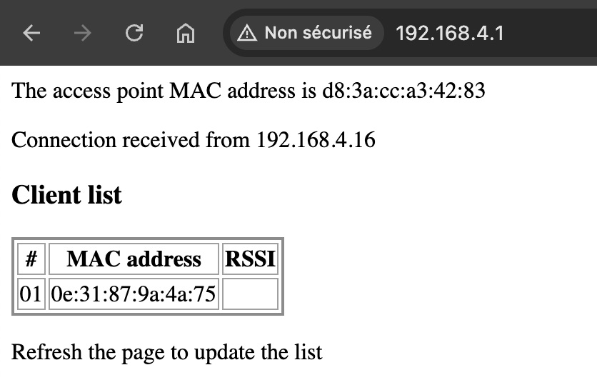

from lib.wifi import Clientfrom lib.wifi import Client

## Connexion WiFi

La carte Raspberry Pi Pico W dispose d'un composant permettant d'établir une connexion à
réseau WiFi.

Le module `wifi` contient deux classes :

- La classe `AccessPoint` va configurer le module radio du Pico en mode point d'accès WiFi.
Ainsi, d'autres Pico W, ordinateurs, smartphones, etc. pourront communiquer avec le Pico W
servant de point d'accès ou entre eux.
- la classe `Client` va permettre de connecter le Pico W à un réseau WiFi existant tel que
celui de la _box_ d'un fournisseur d'accès internet ou d'un smartphone partageant sa
connexion haut débit.

### Les caractéristiques d'un réseau WiFi

La classe `Client` contient également une méthode statique `scan()` qui affiche sur la console
un tableau donnant des informations sur tous les réseaux à portée de l'antenne WiFi du Pico.

```python
import wifi

Client.scan()

# Affiche les réseaux WiFi disponibles :
#
#   |available SSID    |BSSID       |chan|RSSI (dBm)|security      |hidden
# --+------------------+------------+----+----------+--------------+------
#  1|myoffice          |8defdeb457fc|   1|       -75|5:WPA3-PSK    |     3
#  2|Livebox-48F8      |54b7bde7cad8|  11|       -87|5:WPA3-PSK    |     2
```

Le [SSID](https://fr.wikipedia.org/wiki/Service_set_identifier) (_Service Set IDentifier_)
est le nom d'un réseau sans fil selon la norme IEEE 802.11 qui définit le fonctionnement
des réseaux WiFi.
Le SSID sert généralement à identifier les points d'accès sans-fil.

Le BSSID (_Basic Service Set IDentifier_) est une suite d'octets, souvent noté en hexadécimal,
qui désigne de façon unique le point d'accès réseau. Grâce au BSSID, un client peut distinguer
des points d'accès qui auraient le même SSID.

La colonne *chan* (pour _channel_, canal en français) designe 
le [canal radio](https://fr.wikipedia.org/wiki/Liste_des_canaux_Wi-Fi)
sur lequel le point d'accès émet.

Le [RSSI](https://fr.wikipedia.org/wiki/Received_signal_strength_indicator) 
(_Received Signal Strength Indicator_) est une valeur qui indique la puissance du signal
radio WiFi reçu par le Pico.
Cette valeur est notée en [dBm](https://fr.wikipedia.org/wiki/DBm).
Le tableau ci-après donne une indication de la qualité du réseau en fonction du RSSI.

| RSSI    | Qualité de la communication | 
|---------|-----------------------------|
| -30 dBm | Excellente                  |
| -65 dBm | Très bonne                  |
| -70 dBm | Correcte                    |
| -80 dBm | Faible                      |
| -90 dBm | Insuffisante                |

La colonne *security* indique le protocole de sécurité utilisé par chaque réseau.
Les signaux radio WiFi peuvent être entendus par toutes les antennes à portée de réception.
Pour se préserver des ~~oreilles~~ antennes indiscrètes, les données transmises sont cryptées
selon différents protocoles.

Dans l'exemple ci-dessus, WPA3-PSK indique que la sécurité repose sur le protocole 
WPA3 (_Wi-Fi Protected Access 3_) avec un mot de passe partagé ou PSK (_Pre-shared key_).
C'est le protocole de sécurité employé sur le plupart des _box_ internet.

À noter que certains protocoles de sécurité ne sont pas supportés par le Pico, il ne pourra
donc pas se connecter à certains réseaux.

La dernière colonne, intitulée *hidden*, est affichée dans un souci de complétude, mais elle
n'est pas documentée correctement (ou je n'ai pas su trouver d'information fiable).
Sa valeur est supposée indiquer si le réseau correspondant est caché.

### Connecter le Pico à un réseau WiFi

La classe `Client` du module `wifi` est mise en œuvre simplement en fournissant au minimum
le nom du réseau auquel se connecter (le SSID) et le mot de passe du réseau.

```python
import wifi

ssid = "PICO_AP"
password = "pico_password"
wifi.Client(ssid, password, traces=Client.TRACE_ALL, blink_led=True, retries=2, max_power=True)

# Affiche toutes les informations disponibles lors de la connexion :
#
# MAC address: d8:3a:dd:a3:03:83
#
#   |available SSID    |BSSID       |chan|RSSI (dBm)|security      |hidden
# --+------------------+------------+----+----------+--------------+------
#  1|PICO_AP           |d83adda30383|   6|       -52|5:WPA2-PSK    |     3
#  2|myoffice          |8defdeb457fc|   1|       -75|5:WPA3-PSK    |     3
#  3|Livebox-48F8      |54b7bde7cad8|  11|       -87|5:WPA3-PSK    |     2
#
# Connecting SSID: PICO_AP
# Status: Connection in progress..
# Status: Connection in progress, waiting for an IP address.....
#
# IP address: 192.168.4.11
```

Dans l'exemple ci-dessus, le Pico tente de se connecter à un réseau appelé _PICO_AP_
dont le mot de passe est _pico_password_.

Les paramètres optionnels `traces`, `blink_led`, `max_power` et `retries` définissent 
le comportement du Pico lors de la tentative de connexion :

- Si `blink_led` à la valeur `True`, la LED de la carte Pico clignotera pendant les tentatives
de connexion. Elle sera éteinte à la fin.
- Si le paramètre `retries` est positif ou nul, sa valeur détermine le nombre de tentatives
de connexion après la première. Par conséquent, si `retries=0`une seule tentative 
sera effectuée. Si `retries` n'est pas spécifié (ou s'il est négatif) le Pico tentera
indéfiniment de se connecter.
- Le paramètre `traces` détermine les messages affichés sur la console durant le processus
de connexion. Ce paramètre est un entier correspondant à la somme des valeurs des
affichages requis :
    - `TRACE_NONE` : valeur par défaut, aucun affichage.
    - `TRACE_MAC_ADDR` : affiche l'[adresse MAC](https://fr.wikipedia.org/wiki/Adresse_MAC)
  de la carte réseau du Pico.
    - `TRACE_IP_ADDR` : affiche l'[adresse IP](https://fr.wikipedia.org/wiki/Adresse_IP) 
  du Pico obtenue après connexion.
    - `TRACE_SCAN_ONCE` : avant la connexion, affiche un scan des réseaux à proximité du Pico.
    - `TRACE_SCAN_CONTINUOUS` : entre chaque tentative de connexion, affiche un scan 
  des réseaux à proximité du Pico. Si la valeur `TRACE_SCAN_CONTINUOUS` est utilisée,
  `TRACE_SCAN_ONCE` le sera également.
    - `TRACE_CONNECTION` : affiche la progression de la connexion.
    - `TRACE_ALL` : équivalent à `TRACE_MAC_ADDR | TRACE_IP_ADDR | TRACE_SCAN_CONTINUOUS | TRACE_CONNECTION`.
- Le paramètre `max_power` contrôle la consommation énergétique de la radio WiFi. Par défaut,
il a la valeur `True`, la puissance du WiFi est maximisée.
Si le paramètre est initialisé à `False` la puissance de la radio WiFi sera réduite pour 
économiser de l'énergie. Cela peut être utile lorsque le Pico est alimenté par une pile, 
une batterie, un panneau solaire, ...

Pour sélectionner une combinaison d'affichage, il faut faire un _or_ entre les valeurs.
Par exemple, pour afficher la progression de la connexion et l'adresse IP obtenue, on écrira :
```python
traces=Client.TRACE_CONNECTION | Client.TRACE_IP_ADDR
```

### Créer un point d'accès WiFi

Le Raspberry Pi Pico W peut être configuré en point d'accès.
C'est particulièrement utile pour créer un réseau de capteurs, par exemple.

La classe `AccessPoint` du module `wifi` permet de configurer le point d'accès.
Deux paramètres sont obligatoires, le nom du réseau et le mot de passe. Le protocole de
cryptage sera le WPA2 avec une clef partagée (le mot de passe du réseau).

```python
import wifi

# Création d'un point d'accès WiFi
ap = AccessPoint(ssid, password, serve=True)

# Access Point MAC address / BSSID: d8:3a:dd:a3:03:83
# 
# Access Point is active (PICO_AP / password)
# Go to http://192.168.4.1/ to list the connected clients MAC addresses
```

Il est possible d'ajouter deux paramètres booléens optionnels :

- Si `activate` est `False`, le point d'accès est créé mais pas démarré.
Il faudra ultérieurement appeler la méthode `activate(True)` pour activer le point d'accès
et permettre aux clients WiFi de s'y connecter. 
Par défault, le paramètre `activate` à la valeur `True`, le point d'accès est donc immédiatement 
activé après sa création.
- Si `serve` est `True`, un mini-serveur web est démarré en même temps que le point d'accès.
Ce serveur web attend les requêtes à la même adresse que le point d'accès, il ne supporte que
le protocole HTTP (pas HTTPS) et il répond une page web qui liste les clients connectés.
Par défaut `serve=False`, le serveur web n'est donc pas démarré.



### Code et sécurité

Attention, si le code que vous écrivez est enregistré dans le cloud, pour une raison évidente (?) 
de sécurité, vous ne devez pas y laisser vos mots de passe WiFi (ou tout autre mot de passe ou 
clef d'accès). 

Pour séparer les données sensibles du reste du code, vous pouvez créer un fichier intitulé 
`credential.py`, qui contiendra les informations à ne pas divulguer.
Par exemple :

```python
# Ceci est le fichier credential.py
# Ne pas divulguer

wifi_ssid = "PICO_AP"
wifi_password = "password"
```

Puis dans le code de votre application, il suffit d'importer le fichier `credential.py` comme un
module.

```python
import wifi
import credential

# On connecte le Pico au réseau dont le nom et la clef d'accès sont dans le module credential
wifi.Client(credential.wifi_ssid, credential.wifi_password, blink_led=True, retries=2, max_power=True)
```

Bien entendu, vous ne partagerez que le fichier de votre application.
