## LED

Une [LED](https://fr.wikipedia.org/wiki/Diode_%C3%A9lectroluminescente)
(_Light-Emitting Diode_), diode électroluminescente en français, est un composant
électronique semiconducteur qui produit de la lumière lorsqu'il est correctement alimenté.

À ce jour (2024/08/15), toutes les versions des cartes Raspberry Pi Pico sont équipées
d'une LED verte. La broche qui contrôle la LED varie cependant d'un modèle 
à l'autre.

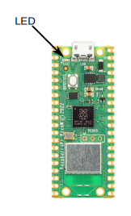

### Allumer la LED du Pico

Le programme suivant allume la LED de la carte Raspberry Pi Pico pendant 5 secondes,
puis l'éteint.

```python
import machine
import time

# On affecte à la variable led_pin un objet décrivant la broche à laquelle
# est connectée la 2_LED du Pico et la configuration de cette broche (ici en sortie).
led_pin = machine.Pin("LED", machine.Pin.OUT)

# On appelle la méthode on() de l'objet led_pin afin de passer la broche correspondante
# à 1. Cela a pour effet d'alimenter la 2_LED qui s'allume.
led_pin.on()

# On utilise la fonction sleep() du module time pour mettre le programme en pause
# pendant 5 secondes.
time.sleep(5)

# On appelle la méthode off() de l'objet led_pin afin de passer la broche correspondante
# à 0. Cela a pour effet d'éteindre la 2_LED.
led_pin.off()
```

Le programme suivant fait clignoter la LED du Pico à une fréquence de 1 Hz, c'est-à-dire
que le cycle d'allumage et d'extinction de la LED se répète 1 fois par seconde.

```python
import machine
import time

# On configure la broche qui contrôle la 2_LED du Pico.
led_pin = machine.Pin("LED", machine.Pin.OUT)

# On démarre une boucle infinie.
while True:
    # On appelle la méthode toggle() de l'objet led_pin afin de changer son état :
    # si la broche est à 1, elle bascule à 0,
    # si elle est à 0, elle bascule à 1.
    led_pin.toggle()
    
    # L'exécution du programme est suspendue pendant 0.5 seconde.
    time.sleep(0.5)
    
    # L'état de la 2_LED reste inchangé (pendant le temps de la pause) jusqu'au
    # tour de boucle suivant.
```

Pouvoir contrôler la LED du Pico est d'une utilité limitée.
Nous allons voir comment connecter d'autres LED au Pico.

### Belle LED

Une LED est un composant électronique qui comporte deux pattes (deux pôles).
On dit que c'est un composant bipolaire ou un dipôle.
Son fonctionnement est non linéaire et polarisé (ou asymétrique). 
Ainsi, le sens de branchement d'une diode détermine le fonctionnement du circuit
dont elle fait partie.

Une diode (LED ou autre) laisse passer le courant si la tension appliquée à l'anode,
le pôle positif, est plus importante qu'à la cathode, le pôle négatif.
Dans cette configuration, la diode est dite passante.
Si la tension est plus importante à la cathode qu'à l'anode, la diode bloque le courant
Dans ce cas, on dit que la diode est bloquée.

À noter que si la différence de potentiel (la différence entre la tension à l'anode et
la tension à la cathode) dépasse une valeur maximale dépendante du modèle de diode employée,
la diode sera détruite.

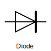
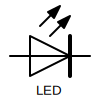 

Les dessins ci-dessus sont les représentations symboliques d'une diode et d'une LED.
Le côté positif d'une diode (l'anode) est matérialisé par un triangle,
le côte négatif (la cathode) est matérialisé par une barre.
Les flêches sur le symbole de la LED figurent la lumière émise par ce type
de diode lorsqu'un courant les traverses (lorsque qu'elles sont passantes).

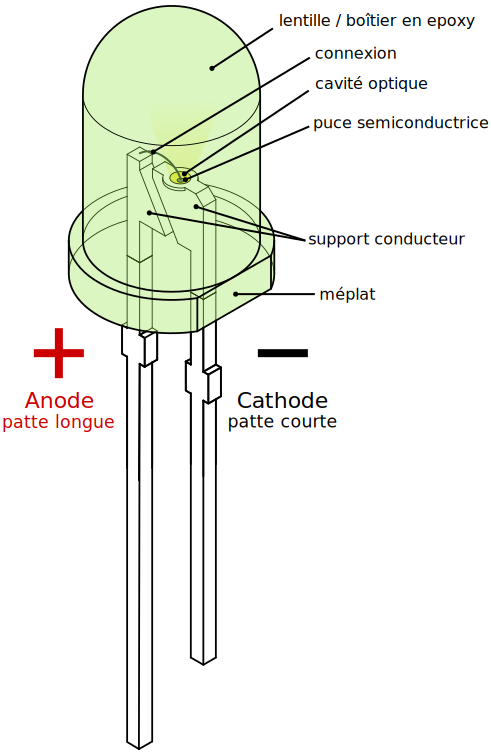

Les LEDs ont des caractéristiques physiques variables. Les plus importantes sont leur
couleur, leur dimension et forme, leur tension d'alimentation et le courant maximum
qui peut les traverser sans les endommager.

La couleur d'une LED est déterminée par le matériau semiconducteur employé pour sa
fabrication (et rarement par la couleur du plastique qui l'encapsule).

Les LEDs que l'on peut utiliser sur une platine de prototypage sont disponibles
dans de nombreuses couleurs et généralement en 3 ou 5 mm de diamètre.


Pour connaître la tension d'alimentation exacte d'une LED et le courant qui peut la
traverser, il faut se référer à sa fiche technique.

La tension de fonctionnement d'une LED se situe généralement entre 1 et 3 volts.
Le courant peut aller de quelques milliampères pour les LEDs les plus courantes qui servent
à la signalisation visuelle, à quelques ampères pour les LEDs servant à l'éclairage.

#### Circuit en série

Les tensions dont nous disposons sont :

- 5 volts fournis à partir de la connexion USB de la carte Raspberry Pi Pico
sur la broche `VBUS`.
- 3.3 volts fournis par le convertisseur de tension qui équipe la carte Raspberry Pi Pico
sur la broche `3V3(OUT)`.

Les tensions fournies par la carte sont donc trop élevées pour alimenter directement 
une LED : il faut réduire la tension. Pour cela, nous allons mettre une résistance en série
avec la LED.

Un circuit électrique en série est un circuit dans lequel des composants bipôlaires
sont connectés les uns à la suite des autres.
La tension aux bornes d'un tel circuit est égale à la somme des tensions aux bornes
de chaque composant.

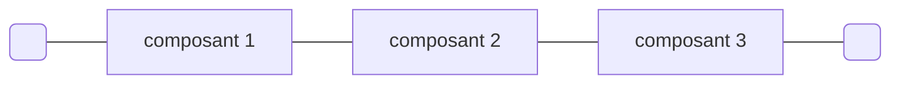

La tension entre les extrémités du circuit est égale à la tension aux bornes de
`composant 1` + la tension aux bornes de `composant 2` + la tension aux bornes de
`composant 3`.

En vertu de la [loi d'Ohm](https://fr.wikipedia.org/wiki/Loi_d%27Ohm), 
une résistance connectée en série avec la LED va permettre d'abaisser la tension 
aux bornes de la LED. 

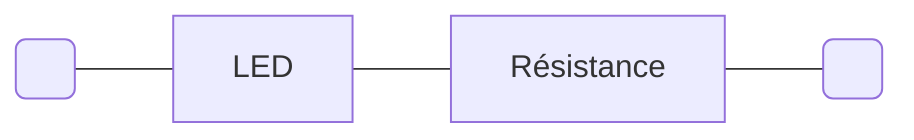

La loi d'Ohm est très simple : la tension `U` (en volts) aux bornes
d'une résistance est égale au produit du courant `I` (en ampères) qui la traverse par
sa valeur `R` (en ohms).

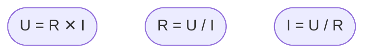

Prenons par exemple une LED dont la tension de fonctionnement est 2 volts et
le courant de fonctionnement 10 milliampères que nous alimentons à partir du rail
à 3.3 volts de notre platine de prototypage.

La tension aux bornes de la résistance doit être 3.3 - 2 = 1.3 volts.
Connaissant la tension (1.3 V) et le courant (10 mA = 0.01 A), la valeur de la résistance
peut-être calculée par la formule `R = U / I = 1.3 / 0.01 = 130 Ω (ohms)`.

Ainsi il faudra connecter la LED en série avec une résistance _d'au moins_ 130 Ω. 
Une valeur de résistance supérieure protégera efficacement la LED mais diminuera sa luminosité.
Une résistance de valeur inférieure n'abaissera pas suffisamment la tension aux bornes
de la LED, la surtension réduira la durée de vie de la LED, voire la détruira.

L'énergie consommée par la résistance pour protéger la LED est dissipée sous forme de chaleur.
Cela implique que la puissance de la résistance doit être appropriée à son usage car, 
si ce n'est pas le cas, la résistance brulera.
Les résistances de 1/8, 1/4 ou 1/2 watt sont communes.
La puissance effectivement dissipée par la résistance se calcule à
l'aide de la formule suivante `P = U ✕ I` avec `P`, la puissance exprimée en watts,
`U` en volts et `I` en ampères.

Dans le cas qui nous occupe, la résistance devra dissiper `P = U ✕ I = 1.3 ✕ 0.01 = 0.013 W`,
une résistance de 1/8 W = 0.125 W suffira donc amplement.

Si vous voulez vous épargner l'effort de ces calculs, nombre de pages web les feront
pour vous. Par exemple : 
[calculateur de résistance pour LED chez DigiKey](https://www.digikey.fr/fr/resources/conversion-calculators/conversion-calculator-led-series-resistor)

#### Résistance ✊


Comme montré dans le dessin ci-dessus, les 
[résistances](https://fr.wikipedia.org/wiki/R%C3%A9sistance_(composant))
peuvent être schématiquement représentées de deux façons. La version en zigzag est 
une représentation normalisée américaine mais largement employée dans le reste du monde.

Ce sont des composants bipôlaires symétrique, ils fonctionnent de manière identique
dans les deux sens.

Les résistances les plus courantes dans les usages de hobby se présentent sous
la forme d'un petit cylindre d'environ 10 mm de long et de 2 ou 3 mm de diamètre
à chaque extrémité duquel sort une patte métallique (que l'on enfichera dans la platine
de prototypage).
Le corps cylindrique porte plusieurs bandes de couleur qui permettent de noter
certaines caractéristiques techniques du composant notamment sa valeur en ohms et 
sa tolérance (la précision de sa valeur).
Le tableau ci-dessous permet de déterminer la valeur d'une résistance d'après la couleur
des bandes qu'elle porte.


Sauriez-vous déterminer les valeurs des résistances ci-dessous (réponse au bas de cette page) ?


Des aides en ligne sont disponibles pour déterminer ces valeurs, par exemple :
[calculateur de code couleur des résistances chez DigiKey](https://www.digikey.fr/fr/resources/conversion-calculators/conversion-calculator-resistor-color-code).

Toutes les valeurs de résistance ne sont pas communément disponibles, il existe des
[séries](https://fr.wikipedia.org/wiki/CEI_60063) de valeurs usuelles.
La série E3, par exemple, ne comporte que les valeurs :
1 Ω, 2.2 Ω, 4.7 Ω, 10 Ω, 22 Ω, 47 Ω, 100 Ω, 220 Ω, 470 Ω,
1 kΩ, 2.2 kΩ, 4.7 kΩ, 10 kΩ, 22 kΩ, 47 kΩ, 100 kΩ, 220 kΩ, 470 kΩ, 
1 MΩ, 2.2 MΩ, 4.7 MΩ, 10 MΩ, 22 MΩ, 47 MΩ, 100 MΩ, 220 MΩ, 470 MΩ.
La série E3 est obsolète mais c'est la plus courte à recopier.

Une série est constituée des multiples et sous-multiples d'un ensemble de valeurs comprises
entre 10 et 100.
La série E3, par exemple, est formée des multiples et sous-multiples de 3 valeurs : 10, 22 et 47. 

Si l'on reprend l'exemple commencé plus haut, pour protéger notre LED, nous avons besoin d'une
résistance de 130 Ω. Cette valeur n'est pas disponible dans la série E3... Ni dans la série E6,
ni même la E12, elle n'apparaît que dans la série E24.

Dans le contexte du prototypage de circuit employant des microcontrôleurs, les LEDs sont 
souvent protégées par des résistances de 220 Ω. C'est une valeur qui fait partie de toutes les
séries et qui est ainsi supposée plus largement disponible.
Cette pratique offre également une marge de sécurité.

#### Représentation schématique et câblage du circuit

Avant de câbler le circuit sur la platine de prototypage, il peut être utile de tracer
un schéma du circuit.

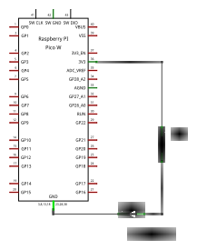

Les circuits intégrés tels que celui utilisé sont généralement symbolisés
de façon générique par un carré ou un rectangle d'où partent les différentes connexions.

Dans le schéma, on peut voir que la résistance et la LED sont câblées en série,
que la cathode (le pôle négatif) de la LED est connectée à la masse 
du Raspberry Pi Pico qui ne sert qu'à produire la tension de 3.3 V.


Le câblage correspond au schéma.

1. L'anode de la LED, la plus longue patte du composant, le côté triangulaire de la diode sur
le schéma, est connectée à une patte de la résistance de 220 Ω (dont le code de couleur est 
rouge rouge marron).
2. L'autre patte de la résistance est connectée au rail à 3.3 V de la platine de prototypage.
3. La cathode, la patte la plus courte de la LED, la barre de la diode sur le schéma, 
est connectée à un rail de masse de la platine de prototypage.

| 🔴⚠️ Vérifiez toujours deux fois votre câblage avant de brancher l'alimentation. ⚠️ 🔴 |
|----------------------------------------------------------------------------------------|

Le câblage de la LED sur la platine de prototypage utilise deux câbles.
L'un (orange) va du rail 3.3 V à la résistance, l'autre (noir) va de la LED
au rail de masse.
Sauriez-vous construire le même circuit sans utiliser ces deux câbles 
(réponse au bas de cette page) ?

### LED clignotante

Nous avons fait clignoter la LED du Pico, faisons la même chose avec une
autre LED.

Commençons par dessiner le schéma de câblage.
Pour cela, nous devons commencer par choisir quelle broche de la carte
Raspberry Pi Pico nous utiliserons pour commander la LED.

Nous allons utiliser la broche 20 de la carte qui correspond au port
GPIO 15 du microcontrôleur RP2040.

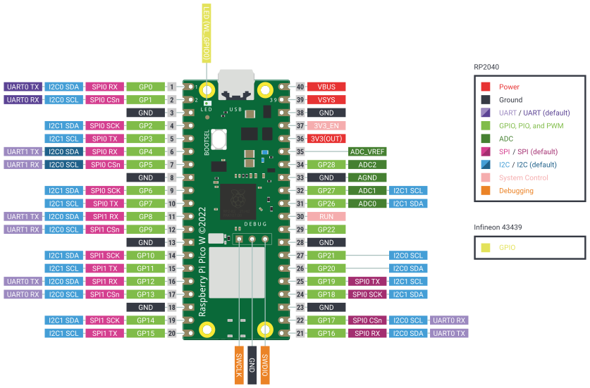

Ce choix est un peu arbitraire.
Mais nous préférerons de conserver les ports GPIO 26, 27 et 28 qui
peuvent être utilisés pour convertir des signaux analogiques en numérique.
Nous reviendrons à ce sujet plus tard.

Le schéma du circuit est simple. C'est la broche du Raspberry Pi Pico
que nous avons choisie qui fournit l'énergie pour alimenter la LED.
Le microcontrôleur RP2040 fonctionnant avec une tension de 3.3 V, la broche
produira cette tension quand nous la programmerons à 1 et sera connectée
à la masse quand nous la programmerons à 0.

À noter cependant que si la broche `3V3(OUT)` peut délivrer 300 mA,
ce n'est pas le cas des broches GPIO.
Ces broches délivrent jusqu'à 4 mA mais cela peut être ajusté
par programmation entre 2 et 12 mA.

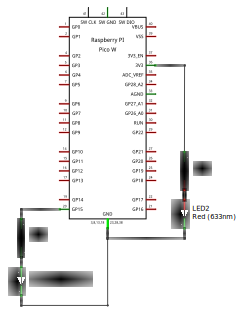

La mise en œuvre du circuit sur la plaque de prototypage est directe.

La broche 20 du Pico est connectée à une résistance de 220 Ω,
elle même connectée à l'anode de la LED. La seconde patte de la LED
(la cathode) est reliée à l'un des rails de masse de la plaque de prototypage
(sans toucher la patte de la résistance).


Le code permettant de faire clignoter la LED connectée au GPIO 15 utilise
la classe `PWMControl` contenue dans le module `pwm_control`.
Le module est donc importé au début du programme. Il doit également être
copié dans le répertoire racine du Raspberry Pi Pico.

```python
from time import sleep

from pwm_control import PWMControl

# La LED est connectée sur la broche 20 qui correspond au GPIO 15.
ext_led_gpio = 15

# On crée un objet de classe PWMControl pour gérer le clignotement. On lui indique
# quelle broche il doit contrôler.
led = PWMControl(ext_led_gpio)

while True:
    # On commence par indiquer à l'objet led que la largeur d'impulsion doit être maximale.
    # La LED s'allume à son intensité maximale (compte tenu de sa tension d'alimentation, de la résistance
    # en série avec le LED, etc.
    led.set_width(1.0)
    # Puis le programme attend pendant 1 seconde.
    sleep(1)
    # On commande l'extinction immédiate de la LED.
    led.set_width(0.0)
    # Le programme attend pendant 1 seconde.
    sleep(1)
    # La LED s'éclairera progressivement pendant la prochaine seconde et demi.
    led.set_width(1.0, duration=1.5)
    # Pendant ce temps, le programme attend 1 seconde et demi.
    sleep(1.5)
    # Après ce délai, on commande l'extinction progressive de la LED pendant 1 seconde et demi.
    led.set_width(0.0, duration=1.5)
    # Puis le programme attend pendant 1 seconde et demi.
    sleep(1.5)
    # On recommence depuis le début de la boucle.
```
Voir le programme complet [`LED_1.py`](https://github.com/jlp6k/art-programming_physical-computing/blob/main/Ateliers/2_LED/LED_1.py).

### Trois LEDs clignotantes

Trois LEDs clignotantes, c'est mieux qu'une seule. C'est pourquoi nous allons
faire clignoter la LED connectée au GPIO 15, une autre LED que nous allons
connecter au GPIO 14 (broche 19). La troisième LED sera celle présente sur la carte 
Raspberry Pi Pico.

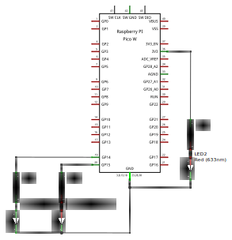

À partir de ce schéma, sauriez-vous câbler la platine de prototypage ?
(Solution en bas de page.)

Si toutes les LEDs clignotent de façon synchrone (simultanément), le programme
est très simple puisqu'il suffit d'ajouter au programme précédent le contrôle
des LEDs supplémentaires.

```python
    # Extrait du programme programme LED_1.py modifié pour contrôler deux LEDs
    green_led = PWMControl(20)
    blue_led = PWMControl(19)

    while True:
        # On allume les LEDs.
        green_led.set_width(1.0)
        blue_led.set_width(1.0)
        
        # On éteint...
```

Cette solution n'est plus envisageable si l'on souhaite que les LEDs
clignotent sur des rythmes différents, par exemple.

C'est l'occasion d'introduire la classe `SceneControl` du module `scene_control`.

Cette classe permet de décrire des scénarios d'appels de fonction
qui seront exécutés indépendamment les uns des autres.

```python
from machine import Pin

from pwm_control import PWMControl
from scene_control import SceneControl

# La LED bleue est connectée sur la broche 19 qui correspond au GPIO 14.
# La LED verte est connectée sur la broche 20 qui correspond au GPIO 15.
blue_led_gpio = 14
green_led_gpio = 15

# On crée un objet de classe PWMControl pour gérer le clignotement. On lui indique
# quelle broche il doit contrôler.
green_led = PWMControl(green_led_gpio)
blue_led = PWMControl(blue_led_gpio)

# La LED qui équipe le Raspberry Pi Pico W ne peut être contrôlée en PWM.
onboard_led = Pin("LED", Pin.OUT)

# Création d'instances de SceneControl.
# Une même instance de SceneControl peut contrôler plusieurs LED (ou appeler des fonctions quelconques).
# Cependant toutes les entités contrôlées fonctionnent dans une même boucle temporelle c'est-à-dire la même
# fréquence d'activation.
# scene_a va être utilisé pour contrôler la LED sur la carte Raspberry Pi Pico et la LED verte.
scene_a = SceneControl()
# scene_b contrôlera la LED blue.
scene_b = SceneControl()

# Quand les méthodes start() des objets scene_a et scene_b seront appelées,
# les scénarios correspondant seront exécutés.

# On n'appelle pas la méthode toggle de l'objet onboard_led. À la place, on programme son exécution immédiate
# au moment où la méthode start sera appelée.
scene_a.add_call_after(0, onboard_led.toggle)
scene_a.add_call_after(1000, onboard_led.toggle)
scene_a.add_call_after(0, green_led.set_width, 1.0)
scene_a.add_call_after(250, green_led.set_width, 0.0, duration=1.5)
# Enfin au bout de 2 secondes, la méthode reinit() sera appelée et le scénario se reproduira
scene_a.add_call_after(2000, scene_a.reinit)
# On notera que le fonctionnement de la LED du Pico et de la LED verte est synchronisé et se reproduit
# à l'identique toutes les 3 secondes.

# On fait de même avec un autre scénario pour contrôler la LED bleue.
scene_b.add_call_after(500, blue_led.set_width, 1.0)
scene_b.add_call_after(1000, blue_led.set_width, 0.0)
scene_b.add_call_after(1001, scene_b.reinit)
# La période de fonctionnement de la scene_b est de 1,001 seconde.
# Les 2 dernières tâches sont espacées de 1ms pour garantir que l'appel de scene_b.reinit()
# sera effectué après l'appel de blue_led.set_width(0.0)

# On démarre les scénarios.
scene_a.start()
scene_b.start()
```
Voir le programme complet [`LED_2.py`](https://github.com/jlp6k/art-programming_physical-computing/blob/main/Ateliers/2_LED/LED_2.py).


> Pour pouvoir utiliser modules `pwm_control` ou `scene_control`, il ne faut pas oublier de 
> copier leur code à la racine du Pico.

À noter que la LED de la carte Raspberry Pi Pico W ne peut être controlée
en PWM (contrairement à celle du Raspberry Pi Pico). Par conséquent, la classe `PWMControl`
ne peut être utilisée avec cette LED.

### Solutions des questions

Valeurs de résistances, de haut en bas :

- 4.7kΩ ±5%
- 2.2kΩ ±5%
- 100Ω ±5%
- 1.5kΩ ±5%
- 47Ω ±5%
- 39kΩ ±5%


Source de l'image : https://en.wikipedia.org/wiki/Resistor#/media/File:Electronic-Axial-Lead-Resistors-Array.png

Version compacte du circuit d'alimentation de la LED :


La platine de prototypage avec une LED connectée à la broche 20 et une autre
connectée à la broche 19.

