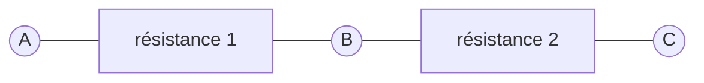
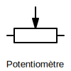
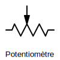
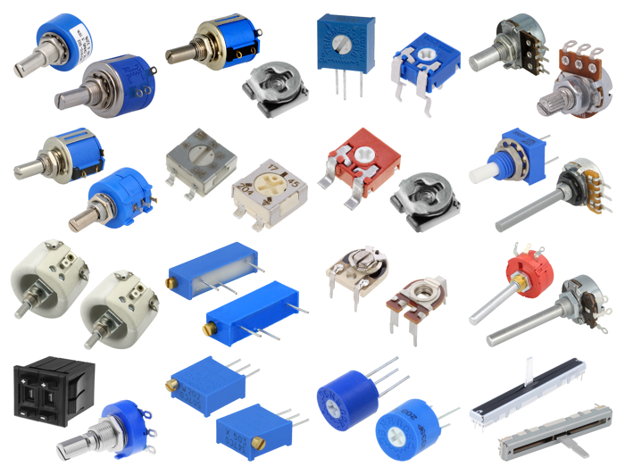
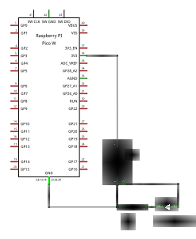
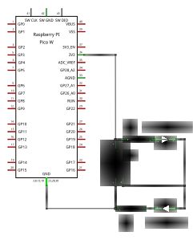

## Potentiomètre

Dans l'atelier sur les LED, nous avons utilisé des résistances pour
abaisser la tension.

Dans le schéma ci-dessous, en vertu de la loi d'Ohm, nous pouvons déduire
que la tension entre A et B est proportionnelle à la tension entre A et C et
au rapport des valeurs des résistances.

Ainsi, quand la résistance 1 est nulle, la tension en B est identique à celle
de A et quand la résistance 2 est nulle, la tension en B est identique à celle
de C. Quand les résistances 1 et 2 sont identiques, la tension mesurée entre
A et B sera égale à celle mesurée entre B et C et ces tensions seront 
la moitié de celle mesurée entre A et C.

Un potentiomètre est un composant à trois bornes qui permet de faire varier
de façon continue les résistances 1 et 2 : la résistance 1 croît
quand la resistance 2 décroît (et inversement).

Les potentiomètres sont généralement représentés schématiquement par les
symboles ci-dessous ([IEC](https://fr.wikipedia.org/wiki/Commission_%C3%A9lectrotechnique_internationale)
à gauche, [ANSI](https://fr.wikipedia.org/wiki/American_National_Standards_Institute) à droite).

Ces schémas permettent également d'entrevoir la disposition mécanique des
potentiomètres : un point de contact est déplacé à l'aide d'un axe
sur une piste résistive.
La résistance entre le point de contact lié à B et
les bornes A et C est proportionelle à la distance du point de contact
aux extrémités A et C de la piste résistive.

Les potentiomètres peuvent avoir de nombreuses formes et dimensions
qui diffèrent selon l'usage auxquels ils sont destinés.
Certains sont miniatures et destinés à être directement soudés à un circuit
imprimé et réglés une fois pour toutes. 
La plupart des potentiomètres sont rotatifs mais certains ont un curseur
qui glisse dans un rail.

Les caractéristiques électriques d'un potentiomètre sont sa résistance
totale, sa puissance et sa courbe de variation. Ce dernier point détermine
comment la résistance varie lorsqu'on déplace le curseur : 
- linéairement, la résistance mesurée entre A et B varie en proportion constante de l'angle 
de rotation,
- logarithmiquement, la résistance varie rapidement au début de la course et plus lentement 
à la fin.

### Régler l'intensité d'une LED

Nous pouvons régler l'intensité lumineuse d'une LED à l'aide de code mais un
potentiomètre permet également de régler la tension d'alimentation d'une LED
et donc sa luminosité.

Le schéma ci-dessous met en œuvre un potentiomètre et une LED.
Une résistance demeure nécessaire pour protéger la LED car lorsque le bouton
du potentiomètre sera tourné à fond à droite, la résistance du circuit
qui conduit à l'anode (borne +) de la LED sera nulle.

#### Avec deux LEDs

Le montage précédent démontre comment la tension d'alimentation varie en fonction de la position
du potentiomètre.
Mais nous l'avons vu, un potentiomètre a (d'une certaine façon) deux résistances, l'une croissant
quand l'autre décroît.
Le tableau ci-après présente les valeurs des deux résistances d'un potentiomètre linéaire de 10kΩ
quand on tourne le bouton.
À partir des valeurs de ces deux résistances, et connaissant la tension d'alimentation du circuit,
on peut calculer les tensions aux bornes du potentiomètre.

Vous pouvez vérifier expérimentalement les valeurs de ce tableau à l'aide d'un multimètre.

Le câblage de deux LEDs exploitant les deux résistances d'un potentiomètre ne présente pas
de difficulté. Il faut cependant bien prendre garde à la polarité (l'orientation des bornes)
des LEDs :
- La `LED1` est branchée à la masse d'un côté (cathode -) et à la borne centrale du potentiomètre 
de l'autre (anode +).
- La `LED2` est branchée à la borne centrale du potentiomètre d'un côté (cathode -) et au rail à 3.3 V
de l'autre (anode +).

En position médiane du potentiomètre, la tension d'alimentation des LEDs est la moitié de la
différence de potentiel entre le rail de masse à 0 V et celui à 3.3 V, c'est-à-dire 1.65 V est
insuffisante pour allumer l'une ou l'autre des 2 LEDs.
