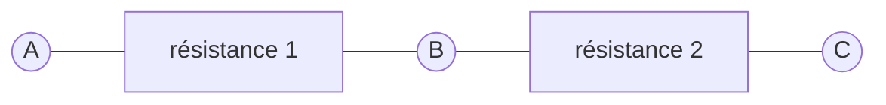

## Potentiomètre

Dans l'atelier sur les LED, nous avons utilisé des résistances pour
abaisser la tension.

Dans le schéma ci-dessous, en vertu de la loi d'Ohm, nous pouvons déduire
que la tension entre A et B est proportionnelle à la tension entre A et C et
au rapport des valeurs des résistances.

Ainsi, quand la résistance 1 est nulle, la tension en B est identique à celle
de A et quand la résistance 2 est nulle, la tension en B est identique à celle
de C. Quand les résistances 1 et 2 sont identiques, la tension mesurée entre
A et B sera égale à celle mesurée entre B et C et ces tensions seront 
la moitié de celle mesurée entre A et C.

Un potentiomètre est un composant à trois bornes qui permet de faire varier
de façon continue les résistances 1 et 2 : la résistance 1 croît
quand la resistance 2 décroît (et inversement).

Les potentiomètres sont généralement représentés schématiquement par les
symboles ci-dessous ([IEC](https://fr.wikipedia.org/wiki/Commission_%C3%A9lectrotechnique_internationale)
à gauche, [ANSI](https://fr.wikipedia.org/wiki/American_National_Standards_Institute) à droite).

Ces schémas permettent également d'entrevoir la disposition mécanique des
potentiomètres : un point de contact est déplacé à l'aide d'un axe
sur une piste résistive.
La résistance entre le point de contact lié à B et
les bornes A et C est proportionelle à la distance du point de contact
aux extrémités A et C de la piste résistive.

Les potentiomètres peuvent avoir de nombreuses formes et dimensions
qui diffèrent selon l'usage auxquels ils sont destinés.
Certains sont miniatures et destinés à être directement soudés à un circuit
imprimé et réglés une fois pour toutes. 
La plupart des potentiomètres sont rotatifs mais certains ont un curseur
qui glisse dans un rail.

Les caractéristiques électriques d'un potentiomètre sont sa résistance
totale, sa puissance et sa courbe de variation. Ce dernier point détermine
comment la résistance varie lorsqu'on déplace le curseur : 
- linéairement, la résistance mesurée entre A et B varie en proportion constante de l'angle 
de rotation,
- logarithmiquement, la résistance varie rapidement au début de la course et plus lentement 
à la fin.

### Régler l'intensité d'une LED

Nous pouvons régler l'intensité lumineuse d'une LED à l'aide de code mais un
potentiomètre permet également de régler la tension d'alimentation d'une LED
et donc sa luminosité.

Le schéma ci-dessous met en œuvre un potentiomètre et une LED.
Une résistance demeure nécessaire pour protéger la LED car lorsque le bouton
du potentiomètre sera tourné à fond à droite, la résistance du circuit
qui conduit à l'anode (borne +) de la LED sera nulle.

#### Avec deux LEDs

Le montage précédent démontre comment la tension d'alimentation varie en fonction de la position
du potentiomètre.
Mais nous l'avons vu, un potentiomètre a (d'une certaine façon) deux résistances, l'une croissant
quand l'autre décroît.
Le tableau ci-après présente les valeurs des deux résistances d'un potentiomètre linéaire de 10kΩ
quand on tourne le bouton.
À partir des valeurs de ces deux résistances, et connaissant la tension d'alimentation du circuit,
on peut calculer les tensions aux bornes du potentiomètre.

Vous pouvez vérifier expérimentalement les valeurs de ce tableau à l'aide d'un multimètre.

Le câblage de deux LEDs exploitant les deux résistances d'un potentiomètre ne présente pas
de difficulté. Il faut cependant bien prendre garde à la polarité (l'orientation des bornes)
des LEDs :
- La `LED1` est branchée à la masse d'un côté (cathode -) et à la borne centrale du potentiomètre 
de l'autre (anode +).
- La `LED2` est branchée à la borne centrale du potentiomètre d'un côté (cathode -) et au rail à 3.3 V
de l'autre (anode +).

En position médiane du potentiomètre, la tension d'alimentation des LEDs est la moitié de la
différence de potentiel entre le rail de masse à 0 V et celui à 3.3 V, c'est-à-dire 1.65 V.
C'est une tension presque insuffisante pour allumer l'une ou l'autre des 2 LEDs.
Cela signifie que l'on est très proche de la tension de seuil des deux LEDs (en dessous de cette
tension, elles ne s'allumeraient pas du tout).

### _Analog to Digital Converter_

Nous allons maintenant utiliser une fonction très utile de beaucoup de microcontrôleurs et
présente dans le RP2040.
Il s'agit de l'ADC (_Analog to Digital Converter_), le [convertisseur analogique-numérique](https://fr.wikipedia.org/wiki/Convertisseur_analogique-num%C3%A9rique).
C'est un composant qui permet de mesurer la tension appliquée à une broche du microcontrôleur
afin d'obtenir une valeur numérique proportionnelle à cette tension.

Le microcontrôleur RP2040 possède un convertisseur AD qui peut gérer jusqu'à 5 entrées 
analogiques dont 4 sont disponibles sur les broches du microcontrôleur.
La 5e entrée analogique est utilisée par le microcontrôleur pour mesurer sa température 
de fonctionnement. Elle ne peut être utilisée pour un autre usage.
Les 4 entrées restantes sont disponibles sur les broches GPIO 26 à 29.
Néanmoins, sur la carte Raspberry Pi Pico le port GPIO 29 est utilisé pour la mesure de 
la tension d'entrée `VSYS` et sur le Raspberry Pi Pico W le GPIO 29 est également utilisé
pour la gestion du module radio WiFi et Bluetooth.
Le GPIO 29 ne pourra donc pas être utilisé pour nos applications.

Par ailleurs, les entrées analogiques ne peuvent être simultanément employées dans un
usage numérique (cf. [1_Base/Brochage du Pico](https://github.com/jlp6k/art-programming_physical-computing/blob/main/Ateliers/1_Base/README.md#brochage-du-pico)).

#### Résolution

Le convertisseur analogique-numérique du RP2040 a une résolution de 12 bits.
Cela signifie qu'il peut produire des valeurs entre 0 et 4095 pour des 
tensions d'entrée allant de 0 V à 3.3 V.
Il faut néanmoins modérer cette résolution car, dans les faits, le niveau 
de bruit du convertisseur, les défauts de la tension de référence, etc. 
sont tels que la résolution effective 
([ENOB](https://en.wikipedia.org/wiki/Effective_number_of_bits))
est plutôt de l'ordre de 8.7 bits 
(cf. [RP2040 datasheet](https://datasheets.raspberrypi.com/rp2040/rp2040-datasheet.pdf), section 4.9.3).

En pratique, cela signifie que la valeur de 12 bits obtenue après une
mesure comporte 3.3 bits d'erreur : par exemple la valeur 2720 devrait être
interprétée comme étant en réalité égale à 2720 ± 4.925.
Si l'on rapporte cela à la tension mesurée cela représente
une erreur de l'ordre de ±0.004 V.

### Mesure de la tension avec le Pico

