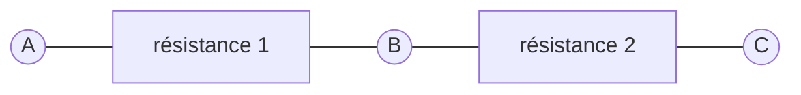

## Potentiomètre

Dans l'atelier sur les LED, nous avons utilisé des résistances pour
abaisser la tension.

Dans le schéma ci-dessous, en vertu de la loi d'Ohm, nous pouvons déduire
que la tension entre A et B est proportionnelle à la tension entre A et C et
au rapport des valeurs des résistances.

Ainsi, quand la résistance 1 est nulle, la tension en B est identique à celle
de A et quand la résistance 2 est nulle, la tension en B est identique à celle
de C. Quand les résistances 1 et 2 sont identiques, la tension mesurée entre
A et B sera égale à celle mesurée entre B et C et ces tensions seront 
la moitié de celle mesurée entre A et C.

Un potentiomètre est un composant à trois bornes qui permet de faire varier
de façon continue les résistances 1 et 2 : la résistance 1 croît
quand la resistance 2 décroît (et inversement).

Les potentiomètres sont généralement représentés schématiquement par les
symboles ci-dessous ([IEC](https://fr.wikipedia.org/wiki/Commission_%C3%A9lectrotechnique_internationale)
à gauche, [ANSI](https://fr.wikipedia.org/wiki/American_National_Standards_Institute) à droite).

Ces schémas permettent également d'entrevoir la disposition mécanique des
potentiomètres : un point de contact est déplacé à l'aide d'un axe
sur une piste résistive.
La résistance entre le point de contact lié à B et
les bornes A et C est proportionelle à la distance du point de contact
aux extrémités A et C de la piste résistive.

Les potentiomètres peuvent avoir de nombreuses formes et dimensions
qui diffèrent selon l'usage auxquels ils sont destinés.
Certains sont miniatures et destinés à être directement soudés à un circuit
imprimé et réglés une fois pour toutes. 
La plupart des potentiomètres sont rotatifs mais certains ont un curseur
qui glisse dans un rail.

Les caractéristiques électriques d'un potentiomètre sont sa résistance
totale, sa puissance et sa courbe de variation. Ce dernier point détermine
comment la résistance varie lorsqu'on déplace le curseur : 
- linéairement, la résistance mesurée entre A et B varie en proportion constante de l'angle 
de rotation,
- logarithmiquement, la résistance varie rapidement au début de la course et plus lentement 
à la fin.

### Régler l'intensité d'une LED

