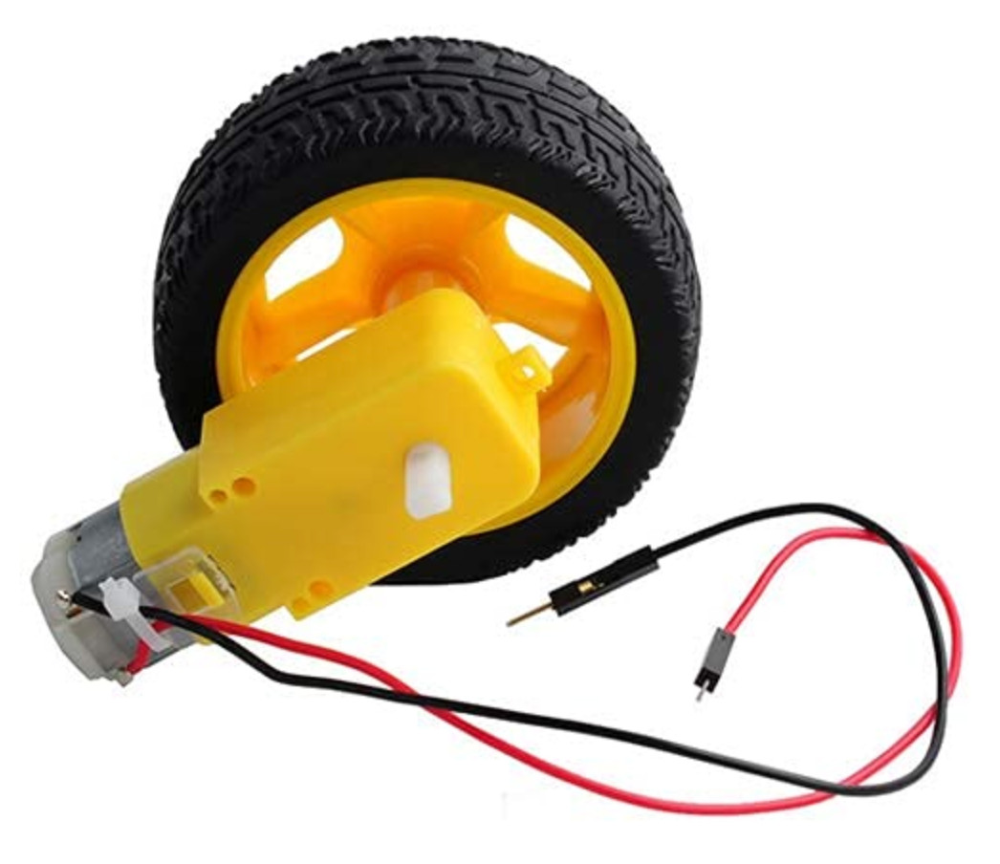
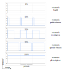

## Moteur électrique à courant continu à balais

Un moteur électrique (ou [machine électrique](https://fr.wikipedia.org/wiki/Machine_%C3%A9lectrique)) est un 
dispositif qui convertit l'énergie électrique en énergie mécanique.
Cette définition formelle et générale recouvre une grande variété d'appareils électriques.
Nous nous intéressons dans cet atelier à un type particulier de moteur électrique, 
le moteur à courant continu à balais (_brushed direct current electric motor_ ou _brushed DC electric motor_
en anglais).
Un autre type de moteur électrique est traité dans l'atelier sur les [`moteurs pas-à-pas`](../Ateliers/7_Moteur_pas-à-pas).

Ce type de moteur est probablement le plus répandu.
C'est celui qui équipe à plupart des petits équipements à piles ou batteries.
On le trouve par exemple dans les jouets ou dans les voitures (pour animer les essuies-glace ou le ventilateur 
du chauffage de l'habitacle ou celui du refroidissement du moteur, mais c'est un autre type de moteur qui sert à la
propulsion du véhicule).

La vidéo ci-dessous illustre le principe de fonctionnement du moteur à courant continu à balais.

[](http://www.youtube.com/watch?v=A3b3Km5KVXs "Moteur DC (courant continu), comment ça marche?")

(N'hésitez pas à suggérer une meilleure vidéo !)

### Couple et vitesse de rotation

Le couple moteur est la force qui agit avec un bras de levier sur un point de pivot, ledit point
étant l'axe de rotation du moteur.
Ce couple moteur est exprimé en Newton par mètre, abrégé N m et correspond à une force exprimée en Newton
exercée sur un bras de levier à 1 mètre de l'axe de rotation.

Le couple et la vitesse de rotation du moteur dépendent de la tension d'alimentation et de l'intensité
du courant aux bornes du moteur.

La vitesse de rotation d'un moteur électrique peut rapidement atteindre des milliers de tours par minutes.
Un dispositif mécanique appelé réducteur, connecté à l'arbre du moteur, permet d'augmenter le couple
en diminuant la vitesse de rotation.

### Mise en œuvre

Nous disposons d'un moteur électrique avec réducteur.



Des fils électriques (rouge et noir) sont connectés aux bornes de ce moteur.
Connectons le fil rouge au rail à 3.3V et le fil noir à un rail de masse (0 volts).
Notez à quelle vitesse et dans quel sens tourne le moteur.
Inversez la polarité : connectez le fil noir à la place du rouge et le fil rouge à la place du noir.
Le fil noir est maintenant connecté au rail à 3.3V et le rouge à la masse.
Observez que le moteur tourne en sens inverse.

Faites de même avec le rail à 5V et un rail de masse ; le moteur tourne plus vite.

### Faire varier la vitesse de rotation

Vous pourriez avoir l'idée d'alimenter le moteur au travers d'un potentiomètre pour faire varier sa tension 
d'alimentation comme nous l'avons fait avec une LED.
Malheureusement cette solution ne fonctionnera de façon acceptable qu'avec un très petit moteur.
En effet, un moteur électrique consomme un courant beaucoup plus important qu'une LED de 5mm de diamètre.

Si nous connectons un ampèremètre (tel que celui disponible dans votre multimètre) en série avec notre
moteur alimenté par le rail à 3.3V, le courant mesuré est de l'ordre de 150mA (soit 0.15A).

Comme nous l'avons vu dans l'atelier [`LED`](../Ateliers/2_LED), la puissance dissipée par un
élément d'un circuit peut être calculée à l'aide de la formule suivante `P = U ✕ I`
avec `P`, la puissance exprimée en watts, `U` la tension en volts aux bornes de l'élément et
`I` le courant qui traverse l'élément en ampères.

Ici le moteur consomme `P = U ✕ I = 3.3 ✕ 0.15 = 0.495 W`
à son plus haut régime.
Si on utilise un potentiomètre pour dissiper une partie de cette énergie afin de réduire la vitesse
du moteur, les caractéristiques du potentiomètre devront être choisies de façon adéquate
et nos petits potentiomètres ne peuvent pas dissiper un demi watt sans brûler.

### Modulation de largeur d'impulsion

Une solution pour faire varier la vitesse de rotation d'un moteur électrique à courant continu à balais
est similaire à celle que nous avons utilisée pour faire varier l'intensité de nos LED.
Cela consiste à alimenter le moteur avec des impulsions périodiques dont la longueur détermine la vitesse.

Le rapport de temps entre le début de deux impulsions consécutives et la durée d'une impulsion est appelé
rapport cyclique (_duty cycle_ en anglais).
Le rapport cyclique détermine le régime/ (la vitesse de rotation) du moteur alimenté par les impulsions.
Plus les impulsions sont longues, plus le moteur accélère (puisqu'il est alimenté pendant chaque impulsion).
Mais, plus le délai entre deux impulsions est long, plus le moteur ralenti (puisqu'il n'est plus alimenté
pendant ce temps).
Si la fréquence des impulsions est suffisamment élevée, les phases d'accélération/décélération se mêlent
pour obtenir une vitesse moyenne.

Ce mode de contrôle du régime moteur s'appelle
[modulation de largeur d'impulsion](https://fr.wikipedia.org/wiki/Modulation_de_largeur_d%27impulsion)
(_pulse width modulation_ ou _PWM_ en anglais).

Le graphique ci-dessous illustre la relation entre le rapport cyclique (la durée des impulsions par rapport
à la durée de la période) et le régime moteur.



D'après ce graphique la tension d'alimentation du moteur est de 0 volt ou de 3.3 volts.
Mais le moteur réagit comme s'il était alimenté par une tension variable entre 0 et 3.3V.

### L298

Contrairement aux petites LED que nous pouvons directement connecter aux broches du Raspberry Pi Pico pour les
alimenter et en contrôler la luminosité, il n'est pas possible d'alimenter un moteur électrique à partir des broches
de notre carte à microcontrôleur.

Pour commander le notre moteur électrique, nous avons besoin d'un circuit de puissance qui va servir d'interface
entre les basses tensions et faible puissance du microcontrôleur et les tensions et puissance plus élevées du moteur
électrique. Ce type de circuit est parfois appelé pilote (ou _driver_ en anglais).

Pour nos activités, nous utiliserons un module basé dur le circuit L298 de STMicroelectronics qui permet de piloter
jusqu'à deux moteurs à courant continu à balais.

La fiche technique du L298 est disponible à l'adresse : https://www.st.com/resource/en/datasheet/l298.pdf

Vous pouvez également consulter un article de blog très complet sur le module : https://passionelectronique.fr/tutoriel-l298n/  

### Mise en œuvre du L298

Pour faire fonctionner un moteur électrique avec un driver L298 commandé depuis un Pico, nous avons besoin d'une
alimentation électrique adaptée à notre moteur et de 3 ports GPIO ; nous choisirons les GPIO 16, 17, 18.
Trois GPIO supplémentaires seraient nécessaire pour faire fonctionner un second moteur.

```python
import pwm_control

# On crée une instance de la classe L298 pour contrôler un circuit
# qui pilote un moteur
l298 = L298(ena_gpio, in1_gpio, in2_gpio)

while True:
    print("Set to forward direction")
    l298.forward()
    for s in range(0, 101):
        speed = s / 100
        print("Setting speed to", speed)
        l298.set_speed(speed)
        sleep(0.1)
    print("Brake")
    l298.brake()
    print("Set speed to 0")
    l298.set_speed(0)

    print("Set to reverse direction")
    l298.reverse()
    for s in range(0, 101):
        speed = s / 100
        print("Setting speed to", speed)
        l298.set_speed(speed)
        sleep(0.1)

    # Don't change direction to quickly
    print("Halt the motor in 3 seconds")
    l298.set_speed(0, duration=3)
    # The set_speed() call returns immediately,
    # so give time for the motor to stop
    sleep(3)


```

Un tutoriel très complet :


https://www.st.com/resource/en/datasheet/l298.pdf

