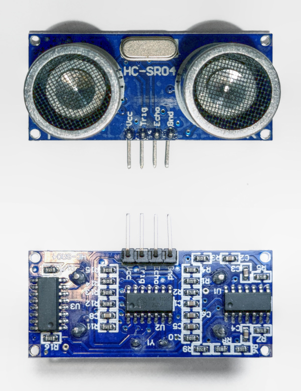
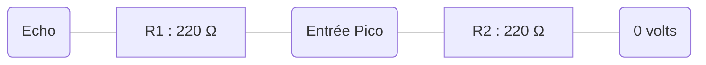
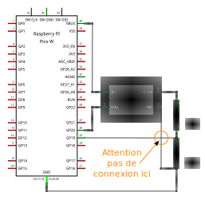
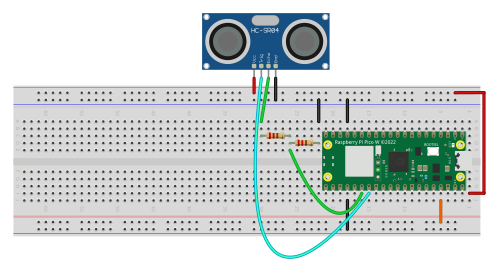

## Capteur de distance à ultrason

Un capteur de distance à ultrason est un capteur actif dont le principe de fonctionnement est comparable
à celui d'un sonar : le capteur émet un signal sonore bref dans les [ultrasons](https://fr.wikipedia.org/wiki/Ultrason)
et écoute l'écho de cette impulsion.

La vitesse du son dans l'air étant d'environ 344 m/s, le temps écoulé entre l'émission et la réception de l'écho
permet de calculer la distance entre le capteur et l'obstacle situé devant lui.
Par exemple, s'il s'écoule 0.1 seconde entre l'émission et la réception, cela signifie que le signal sonore a mis
0.1 seconde pour faire l'aller-retour entre le capteur et l'obstacle, la distance parcourue est de 344 ✕ 0.1 = 344 m 
aller-retour, soit 32.2 m entre le capteur et l'obstacle.


Dans le schéma ci-dessus, des impulsions sonores sont émises en direction de l'objet à détecter (figurées en rouge).
Elles sont réfléchies par l'objet et reviennent vers le récepteur (en vert).
La distance entre le capteur et l'objet `r = t * V / 2` où `t` est le temps mis par une impulsion sonore pour faire
l'aller-retour et `V` est la vitesse du son dans le milieu ambiant.

À noter que la mesure peut être perturbée de multiples façons :

- par la forme de l'objet qui va renvoyer l'écho ailleurs que vers le capteur,
- par l'hétérogénéité du milieu qui va faire varier la vitesse de propagation de
l'onde, l'atténuer, la dévier,
- par l'[effet Doppler](https://fr.wikipedia.org/wiki/Effet_Doppler) qui va changer sa fréquence si le capteur ou
l'objet détecté sont en mouvement,
- ...

## Le capteur HC-SR04

Le capteur HC-SR04 est un capteur actif à ultrason qui permet de mesurer la distance d'objets situés
dans le champ du capteur qui couvre environ 15 degrés et à une distance comprise entre 2 cm et 4 mètres
En pratique, c'est plutôt de 10 cm à 2 m et il faut que l'objet présente face au capteur une surface
de près d'un demi mètre carré.



Ce capteur a une tension de fonctionnement de 5 volts. Cela signifie que sa sortie ne peut pas être
directement connectée à un microcontrôleur dont les entrées sont limités à 3.3 volts comme le RP2040
qui équipe la carte Raspberry Pi Pico que nous utilisons.

| 🔴⚠️ Ne jamais connecter une broche d'entrée du Raspberry Pi Pico à une tension supérieure à 3.3 V ⚠️ 🔴 |
|----------------------------------------------------------------------------------------------------------|

Le module HC-SR04 comporte 4 broches :

- Vcc doit recevoir 5 volts pour que le module fonctionne.
- Gnd sera connecté à la masse (0V). On prendra garde à connecter Gnd avant Vcc sinon le module pourrait ne pas 
fonctionner correctement.
- Trig (pour _trigger_ en anglais, c'est-à-dire gachette en français) déclenche l'émission d'une impulsion
ultrasonique lorsqu'elle passe de l'état bas (0) à l'état haut (1). Bien que la tension de fonctionnement
du module soit 5 volts, il est possible de déclencher l'impulsion avec 3.3V.
- Echo passe de l'état bas à l'état haut lorsque l'écho d'une impulsion est reçu. Cette broche ne peut être
directement connectée au Pico car l'état haut du module correspond à sa tension de fonctionnement,
c'est-à-dire 5 volts.

### Connexion du HC-SR04 au Pico

La tension de sortie de la broche Echo étant supérieure à 3.3V, il faut l'abaisser pour pouvoir connecter
le capteur au microcontrôleur.
Il y a plusieurs façons d'abaisser la tension, mais nous utiliserons le principe vu dans l'atelier sur les
potentiomètres.



Dans le diagramme de principe ci-dessus, Echo représente la sortie du module HC-SR04.
Cette broche peut être à 0V (niveau logique bas ou 0) ou à 5V (niveau logique haut ou 1).
À l'autre extrémité, le circuit est relié à la masse.
Et au milieu du circuit, entre deux résistances de même valeurs (220 Ω), ce trouve la broche d'entrée du Pico
sur laquelle on veut recevoir la sortie du capteur HC-SR04.

Ce circuit est appelé pont diviseur de tension. Examinons son fonctionnement.

- Cas 0, la broche Echo est à 0V. Il n'y a pas de différence de potentiel entre les deux extrémités 
du circuit, tous les points du circuit sont à 0V : l'entrée du Pico reçoit 0V.
- Cas 1, la broche Echo est à 5V. La différence de potentiel entre les extrémités du circuit s'élève à 5V.
Cette tension correspond à la somme des tensions aux bornes des résistances R1 et R2.
Les deux résistances étant de mêmes valeurs, les tensions à leurs bornes sont identiques et égales à la moitié
de la tension aux bornes du circuit, soit 2.5V.

Ainsi, en constituant un pont diviseur avec deux résistances identiques, la tension entre le point central et
l'une des extrémités est la moitié de la tension entre les extrémités du circuit.

Le schéma complet et le prototype sur une _breadboard_ sont présenté ci-dessous.
Le GPIO 20 (broche 26 du Pico) est connecté à l'entrée Trig (_Trigger_) du HC-SR04.
La sortie Echo du HC-SR04 est connectée au GPIO 19 (broche 25) du Pico à travers le pont
diviseur.





Le code exploite la classe `HCSR04` du module `sensors`.

```python
from time import sleep
from sensors import HCSR04

# Le HC-SR04 nécessite deux GPIOs : trigger et echo.
# Le premier sert à démarrer la mesure et le second renvoie la distance mesurée.
trigger_gpio = 20
echo_gpio = 19

# On crée une instance de la classe HC-SR04, elle met en œuvre le processus de mesure.
hcsr04 = HCSR04(trigger_gpio, echo_gpio)

# On fait une mesure par seconde.
while True:
    # On appelle la methode measure() de l'objet hcsr04, elle renvoie la distance 
    # mesurée en centimètre ou -1 quand la distance dépasse les capacités maximales
    # du HC-SR04 range.
    distance_cm = hcsr04.measure()

    if distance_cm != -1:
        print(f"distance: {distance_cm} cm")
    else:
        print(f"Out of range")

    # On interrompt le programme pendant 1 seconde.
    sleep(1)
```