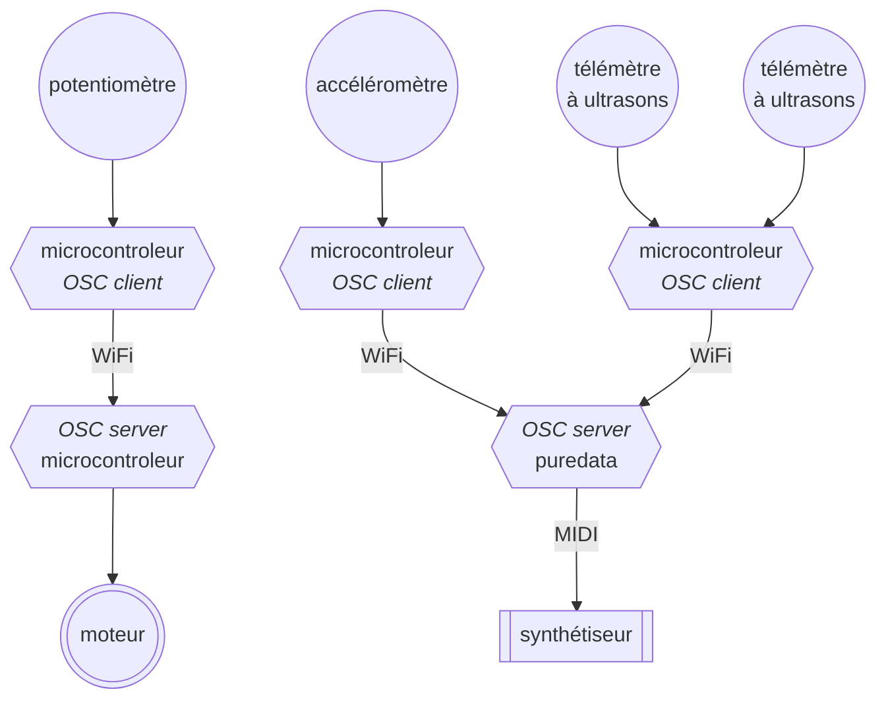
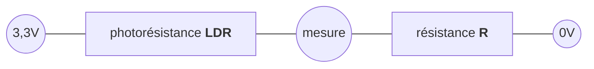
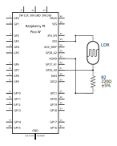

## Open Sound Control

_[Open Sound Control](https://fr.wikipedia.org/wiki/Open_Sound_Control)_ ou simplement OSC 
est un protocole de transfert de données entre toutes sortes d'équipements, ordinateurs,
synthétiseurs, robots, éclairages, ...
Le protocole définit sous quelle forme les données transitent d'un équipement à l'autre,
mais pas le moyen qu'elles empruntent ; un réseau sans fil ou filaire, par exemple.

Une présentation simple (en anglais) du protocole OSC est disponible sur
[OpenSoundControl.org](https://OpenSoundControl.org/).

OSC repose sur une architecture client-serveur, cela signifie qu'un ou plusieurs équipements,
appelés clients, envoient des informations à un serveur.



Dans notre cas, les clients sont des microcontrôleurs auxquels sont rattachés des capteurs.
Ils envoient les données de ces capteurs vers un serveur, ici un autre microcontrôleur ou un
ordinateur faisant fonctionner le logiciel Puredata (par exemple).

Dans le schéma ci-dessus, le synthétiseur est connecté à l'ordinateur avec une connexion
[MIDI](https://fr.wikipedia.org/wiki/Musical_Instrument_Digital_Interface), tandis que le
moteur est directement raccordé au microcontrôleur.

L'intérêt du protocole OSC est ici notamment lié à l'absence de liaison physique entre
le potentiomètre et le moteur ou entre les autres capteurs et le synthétiseur.
On peut donc imaginer des dispositifs portatifs adaptés à une situation performative.

### Message

Les clients envoient des messages au serveur.
Chaque message est constitué de trois parties :
 1. Une adresse sous la forme d'une chaîne de caractères commençant par un `/` (slash) qui décrit
la destination des données dans le serveur.
 2. Un descripteur de type sous la forme d'une chaîne de caractères décrivant le type ou les types
de la donnée ou des données stockées dans la troisième partie du message :
    - `i` : un entier sur 32 bits,
    - `f` : un nombre virgule flottante sur 32 bits,
    - `s` : une chaîne de caractère terminée par le caractère `'\0'`
    ([ASCII](https://en.wikipedia.org/wiki/ASCII) Null),
    - `b` : souvent appelé _blob_, un entier sur 32 bits spécifiant la taille du
    blob suivi par une suite d'octets constituant les données du blob,
    - `T` : True, le type suffit, aucune donnée n'est ajouté,
    - `F` : False, le type suffit, aucune donnée n'est ajouté,
    - `N` : Null, nil, None, etc., le type suffit, aucune donnée n'est ajouté,
    - `I` : Impulse ou bang, pour déclencher un mécanisme contrôlé par le serveur,
    aucune donnée n'est ajouté,
    - `t` : marqueur temporel au
    [format NTP](https://fr.wikipedia.org/wiki/Network_Time_Protocol#Impl%C3%A9mentation).
 3. Des données dans les formats précisés ci-dessous.

Par exemple, imaginons une station météo qui produit une musique en fonction des conditions
atmosphériques. Ce n'est pas une idée nouvelle (cf. 
[_Atmospherics/Weather Works_](https://whitney.org/exhibitions/andrea-polli),
[_Weather Chimes_](https://www.rit.edu/imagine/exhibits/data-sonification-weather-chimes),
[_Weather Warlock_](https://weatherfortheblind.org/), ...) mais il y a, à mon avis,
encore de la place dans ce domaine.
Un capteur de température placé en extérieur permettrait de faire varier, par exemple, la hauteur
de la mélodie.
Un microcontrôleur alimenté par une batterie rechargée par un panneau photovoltaïque relèverait
régulièrement la température mesurée par le capteur et l'enverrait à un serveur OSC situé à l'abri
des intempéries à l'intérieur d'un bâtiment proche.
Le serveur produirait la musique grâce à un patch Puredata et l'enverrait vers une webradio.

### Photorésistance

Nous n'allons pas construire une station météo mais nous disposons d'un capteur de luminosité,
qui pourrait être utilisé dans une telle installation,
une [photorésistance](https://fr.wikipedia.org/wiki/Photor%C3%A9sistance)
(LDR ou _Light Dependent Resistor_ en anglais).
Il s'agit d'un composant semi-conducteur à deux broches dont la résistance diminue quand 
l'intensité lumineuse à laquelle il est exposé augmente.

En l'absence de lumière, la résistance d'une LDR est potentiellement infinie puisqu'aucun photon
ne vient permettre aux électrons de traverser le composant.
En pratique on considère que la résistance d'une LDR dans l'obscurité sera de l'ordre de 10-100MΩ
(10 à 100 millions d'ohms).
En intérieur, une LDR pourra avoir une résistance autour de quelques kilos ou dizaines de kilos ohms.
En pleine lumière, par exemple en éclairant la LDR avec la torche de nos smartphones, la résistance
peut descendre en dessous de 100Ω.

À noter que 
- la variation de résistance d'une LDR n'est pas une fonction linéaire de l'illumination,
- il existe différents types et modèle de LDR avec chacune leurs caractéristiques propres,
- que pour un modèle donné, chaque LDR sera, comme pour tous les autres composants électroniques,
légèrement différente.


Si on construit, comme ci-dessous, un pont diviseur de tension avec une LDR, la tension au point central du pont
dépendra de l'éclairage de la photorésistance.



Dans le schéma ci-dessus, la tension entre la masse (0V) et le point de mesure sera inversement
proportionelle à la résistance de la LDR (plus la résistance de la LDR sera grande, plus la tension
au point de mesure sera proche de 0V).
Autrement dit, la résistance de la LDR diminue quand l'illumination augmente et cela provoque
une augmentation de la tension au point de mesure.

Le choix de la résistance $R$ influe sur la manière dont la tension varie au point de mesure.
La valeur de la tension peut être calculée par la fonction ci-dessous.

$$V_{mesure} = \frac{3.3R}{LDR+R}$$

Le tableau suivant donne une indication de la tension au point de mesure pour deux valeurs
de $R$ et différentes conditions d'éclairement.
Le choix de cette résistance sera fonction de l'usage du circuit.
Par exemple on privilégiera une valeur de $R$ de quelques centaines d'ohms si le circuit doit
être employé dans des conditions d'éclairement plutôt intense afin que la tension varie beaucoup
dans cette situation (et peu au-delà).

|   Éclairage   |     $LDR$     | $R=220Ω$ | $R=10kΩ$ |
|:-------------:|:-------------:|:--------:|:--------:|
| _Plein jour_  |     100 Ω     |  2,27 V  |  3,27 V  |
|               |     200 Ω     |  1,73 V  |  3,24 V  |
|               |     400 Ω     |  1,17 V  |  3,17 V  |
|               |     800 Ω     |  0,71 V  |  3,06 V  |
|               |    1 600 Ω    |  0,40 V  |  2,84 V  |
|               |    3 200 Ω    |  0,21 V  |  2,50 V  |
|               |    6 400 Ω    |  0,11 V  |  2,01 V  |
|               |   12 800 Ω    |  0,06 V  |  1,45 V  |
|               |   25 600 Ω    |  0,03 V  |  0,93 V  |
|               |   51 200 Ω    |  0,01 V  |  0,54 V  |
|               |   102 400 Ω   |  0,01 V  |  0,29 V  |
|               |   204 800 Ω   |  0,00 V  |  0,15 V  |
|               |   409 600 Ω   |  0,00 V  |  0,08 V  |
|               |   819 200 Ω   |  0,00 V  |  0,04 V  |
|               |  1 638 400 Ω  |  0,00 V  |  0,02 V  |
|               |  3 276 800 Ω  |  0,00 V  |  0,01 V  |
|               |  6 553 600 Ω  |  0,00 V  |  0,01 V  |
|               | 13 107 200 Ω  |  0,00 V  |  0,00 V  |
|               | 26 214 400 Ω  |  0,00 V  |  0,00 V  |
|               | 52 428 800 Ω  |  0,00 V  |  0,00 V  |
| _Pleine nuit_ | 104 857 600 Ω |  0,00 V  |  0,00 V  |


Le circuit ci-dessous met en œuvre ce que nous venons de voir.




Le code est similaire à l'un de ceux de l'atelier sur les [potentiomètres](../Ateliers/3_Potentiomètre).

```python
from time import sleep
from averaging_adc import AveragingADC

# On crée un objet de classe AveragingADC.
# Par défaut, la moyenne est calculée sur les 16 dernières mesures...
# Dans cet exemple, nous ferons la moyenne sur les 64 dernières mesures.
adc = AveragingADC(0, average_size=64)
last_measure = None


# Dans une boucle infinie...
while True:
    # On attend 1/40e de seconde. Mais pendant ce temps, le programme fait 10 mesures.
    for _ in range(10):
        new_measure = adc.raw_u16()
        sleep(1 / 400)

    # Si la mesure a changé depuis le dernier affichage,
    # on l'affiche sur la console (avec 3 décimales pour les volts)
    if new_measure != last_measure:
        # Les méthodes read_u16() et volts() renvoient la moyenne des mesures
        print(f"{adc.read_u16()} {adc.volts():5.3f} V")
        last_measure = new_measure
```

### Client OSC

Le circuit ci-dessus sera également celui de notre client OSC mais le code va être adapté.
Le Pico se connecte d'abord à un réseau WiFi.
Une fois la connexion établie, il mesure les variations de tension d'un pont diviseur de
tension avec une LDR et envoie les valeurs vers un serveur OSC.


