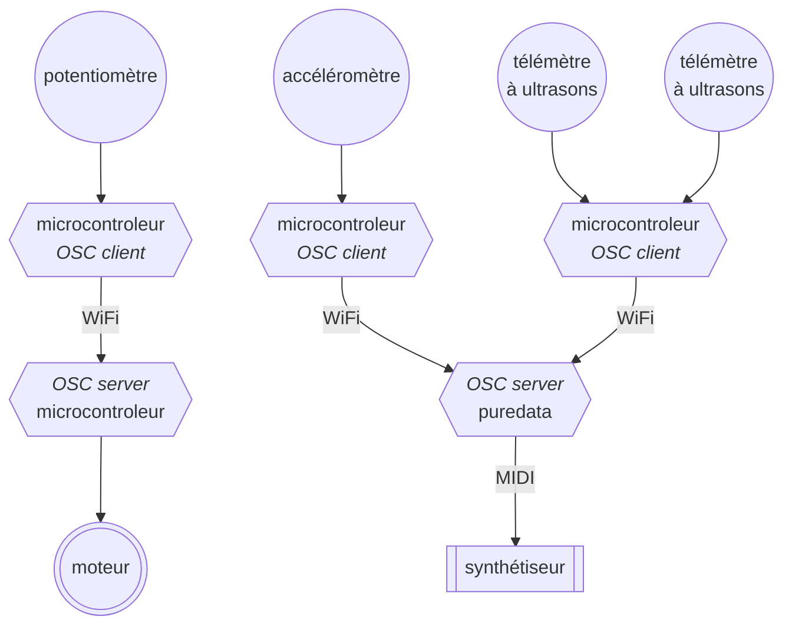
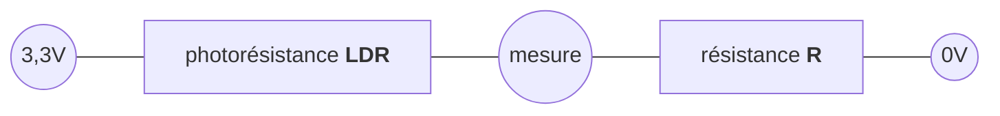
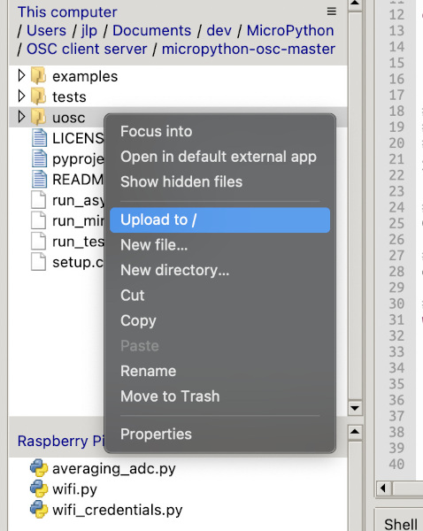

## Open Sound Control

_[Open Sound Control](https://fr.wikipedia.org/wiki/Open_Sound_Control)_ ou simplement OSC 
est un protocole de transfert de données entre toutes sortes d'équipements, ordinateurs,
synthétiseurs, robots, éclairages, ...
Le protocole définit sous quelle forme les données transitent d'un équipement à l'autre,
mais pas le moyen qu'elles empruntent ; un réseau sans fil ou filaire, par exemple.

Une présentation simple (en anglais) du protocole OSC est disponible sur
[OpenSoundControl.org](https://OpenSoundControl.org/).

OSC repose sur une architecture client-serveur, cela signifie qu'un ou plusieurs équipements,
appelés clients, envoient des informations à un serveur.



Dans notre cas, les clients sont des microcontrôleurs auxquels sont rattachés des capteurs.
Ils envoient les données de ces capteurs vers un serveur, ici un autre microcontrôleur ou un
ordinateur faisant fonctionner le logiciel Puredata (par exemple).

Dans le schéma ci-dessus, le synthétiseur est connecté à l'ordinateur avec une connexion
[MIDI](https://fr.wikipedia.org/wiki/Musical_Instrument_Digital_Interface), tandis que le
moteur est directement raccordé au microcontrôleur.

L'intérêt du protocole OSC est ici notamment lié à l'absence de liaison physique entre
le potentiomètre et le moteur ou entre les autres capteurs et le synthétiseur.
On peut donc imaginer des dispositifs portatifs adaptés à une situation performative.

### Message

Les clients envoient des messages au serveur.
Chaque message est constitué de trois parties :
 1. Une adresse sous la forme d'une chaîne de caractères commençant par un `/` (slash) qui décrit
la destination des données dans le serveur.
 2. Un descripteur de type sous la forme d'une chaîne de caractères décrivant le type ou les types
de la donnée ou des données stockées dans la troisième partie du message :
    - `i` : un entier sur 32 bits,
    - `f` : un nombre virgule flottante sur 32 bits,
    - `s` : une chaîne de caractère terminée par le caractère `'\0'`
    ([ASCII](https://en.wikipedia.org/wiki/ASCII) Null),
    - `b` : souvent appelé _blob_, un entier sur 32 bits spécifiant la taille du
    blob suivi par une suite d'octets constituant les données du blob,
    - `T` : True, le type suffit, aucune donnée n'est ajouté,
    - `F` : False, le type suffit, aucune donnée n'est ajouté,
    - `N` : Null, nil, None, etc., le type suffit, aucune donnée n'est ajouté,
    - `I` : Impulse ou bang, pour déclencher un mécanisme contrôlé par le serveur,
    aucune donnée n'est ajouté,
    - `t` : marqueur temporel au
    [format NTP](https://fr.wikipedia.org/wiki/Network_Time_Protocol#Impl%C3%A9mentation).
 3. Des données dans les formats précisés ci-dessous.

Par exemple, imaginons une station météo qui produit une musique en fonction des conditions
atmosphériques. Ce n'est pas une idée nouvelle (cf. 
[_Atmospherics/Weather Works_](https://whitney.org/exhibitions/andrea-polli),
[_Weather Chimes_](https://www.rit.edu/imagine/exhibits/data-sonification-weather-chimes),
[_Weather Warlock_](https://weatherfortheblind.org/), ...) mais il y a, à mon avis,
encore de la place dans ce domaine.
Un capteur de température placé en extérieur permettrait de faire varier, par exemple, la hauteur
de la mélodie.
Un microcontrôleur alimenté par une batterie rechargée par un panneau photovoltaïque relèverait
régulièrement la température mesurée par le capteur et l'enverrait à un serveur OSC situé à l'abri
des intempéries à l'intérieur d'un bâtiment proche.
Le serveur produirait la musique grâce à un patch Puredata et l'enverrait vers une webradio.

### Photorésistance

Nous n'allons pas construire une station météo mais nous disposons d'un capteur de luminosité,
qui pourrait être utilisé dans une telle installation,
une [photorésistance](https://fr.wikipedia.org/wiki/Photor%C3%A9sistance)
(LDR ou _Light Dependent Resistor_ en anglais).
Il s'agit d'un composant semi-conducteur à deux broches dont la résistance diminue quand 
l'intensité lumineuse à laquelle il est exposé augmente.

En l'absence de lumière, la résistance d'une LDR est potentiellement infinie puisqu'aucun photon
ne vient permettre aux électrons de traverser le composant.
En pratique on considère que la résistance d'une LDR dans l'obscurité sera de l'ordre de 10-100MΩ
(10 à 100 millions d'ohms).
En intérieur, une LDR pourra avoir une résistance autour de quelques kilos ou dizaines de kilos ohms.
En pleine lumière, par exemple en éclairant la LDR avec la torche de nos smartphones, la résistance
peut descendre en dessous de 100Ω.

À noter que 
- la variation de résistance d'une LDR n'est pas une fonction linéaire de l'illumination,
- il existe différents types et modèle de LDR avec chacune leurs caractéristiques propres,
- que pour un modèle donné, chaque LDR sera, comme pour tous les autres composants électroniques,
légèrement différente.


Si on construit, comme ci-dessous, un pont diviseur de tension avec une LDR, la tension au point central du pont
dépendra de l'éclairage de la photorésistance.



Dans le schéma ci-dessus, la tension entre la masse (0V) et le point de mesure sera inversement
proportionelle à la résistance de la LDR (plus la résistance de la LDR sera grande, plus la tension
au point de mesure sera proche de 0V).
Autrement dit, la résistance de la LDR diminue quand l'illumination augmente et cela provoque
une augmentation de la tension au point de mesure.

Le choix de la résistance $R$ influe sur la manière dont la tension varie au point de mesure.
La valeur de la tension peut être calculée par la fonction ci-dessous.

$$V_{mesure} = \frac{3.3R}{LDR+R}$$

Le tableau suivant donne une indication de la tension au point de mesure pour deux valeurs
de $R$ et différentes conditions d'éclairement.
Le choix de cette résistance sera fonction de l'usage du circuit.
Par exemple on privilégiera une valeur de $R$ de quelques centaines d'ohms seulement si le circuit doit
être employé dans des conditions d'éclairement plutôt intense afin que la tension varie beaucoup
dans cette situation (et peu au-delà).

|   Éclairage   |     $LDR$     | $R=220Ω$ | $R=10kΩ$ |
|:-------------:|:-------------:|:--------:|:--------:|
| _Plein jour_  |     100 Ω     |  2,27 V  |  3,27 V  |
|               |     200 Ω     |  1,73 V  |  3,24 V  |
|               |     400 Ω     |  1,17 V  |  3,17 V  |
|               |     800 Ω     |  0,71 V  |  3,06 V  |
|               |    1 600 Ω    |  0,40 V  |  2,84 V  |
|               |    3 200 Ω    |  0,21 V  |  2,50 V  |
|               |    6 400 Ω    |  0,11 V  |  2,01 V  |
|               |   12 800 Ω    |  0,06 V  |  1,45 V  |
|               |   25 600 Ω    |  0,03 V  |  0,93 V  |
|               |   51 200 Ω    |  0,01 V  |  0,54 V  |
|               |   102 400 Ω   |  0,01 V  |  0,29 V  |
|               |   204 800 Ω   |  0,00 V  |  0,15 V  |
|               |   409 600 Ω   |  0,00 V  |  0,08 V  |
|               |   819 200 Ω   |  0,00 V  |  0,04 V  |
|               |  1 638 400 Ω  |  0,00 V  |  0,02 V  |
|               |  3 276 800 Ω  |  0,00 V  |  0,01 V  |
|               |  6 553 600 Ω  |  0,00 V  |  0,01 V  |
|               | 13 107 200 Ω  |  0,00 V  |  0,00 V  |
|               | 26 214 400 Ω  |  0,00 V  |  0,00 V  |
|               | 52 428 800 Ω  |  0,00 V  |  0,00 V  |
| _Pleine nuit_ | 104 857 600 Ω |  0,00 V  |  0,00 V  |


Le circuit ci-dessous met en œuvre ce que nous venons de voir.


Le code est similaire à l'un de ceux de l'atelier sur les [potentiomètres](../Ateliers/3_Potentiomètre).

On n'oubliera pas de copier le module `averaging_adc` sur le Pico.

```python
from time import sleep
from averaging_adc import AveragingADC

# On crée un objet de classe AveragingADC.
# Par défaut, la moyenne sera calculée sur les 16 dernières mesures.
# Mais dans cet exemple, nous ferons la moyenne sur les 64 dernières mesures
adc = AveragingADC(0, average_size=64)
last_measure = None

# Dans une boucle infinie...
while True:
    # On attend 1/40e de seconde... Mais pendant ce temps, le programme fait 10 mesures.
    for _ in range(10):
        new_measure = adc.raw_u16()
        sleep(1 / 400)

    # Si la mesure a changé, on l'affiche sur la console
    # (avec 3 décimales pour les volts)
    if new_measure != last_measure:
        # On affiche les résultats de mesures sur la console 
        # Les méthodes read_u16() et volts() renvoient la moyenne des mesures
        print(f"{adc.read_u16()} {adc.volts():5.3f} V")
        last_measure = new_measure
```

### Micropython OSC

Nous utiliserons la bibliothèque [micropython-osc](https://github.com/SpotlightKid/micropython-osc/)
(aussi appelée uosc).

Téléchargez une archive du code source de la bibliothèque sur la page web du dépôt GitHub :


Ensuite il faut décompresser le fichier d'archive `micropython-osc-master.zip` puis copier
le sous-dossier `uosc` sur le Pico.



Et pour terminer, il faut également copier le fichier `osc.py` qui contient le code source du 
module `osc` que nous allons utiliser.
Nous n'utiliserons pas directement `uosc`, c'est ce module qui importe la bibliothèque `uosc`.

### Serveur OSC

OSC implique une architecture logicielle client-serveur.
Commençons par le serveur.

Le code ci-dessous crée un point d'accès WiFi et un serveur OSC.
À noter que seule la partie OSC est ici indispensable, nous pourrions choisir de connecter
le Raspberry Pico W à un réseau WiFi existant, celui de notre téléphone par exemple.

Lorsque le serveur OSC reçoit un message, il vérifie qu'il est bien formé et crée un quadruplet
`(oscaddr, tags, args, src)` qu'il transmet à une instance de  la classe `InputHandler` :

- `oscaddr` : est le chemin auquel le client a envoyé ses données,
- `tags` :  décrit le type des données transmises,
- `args` : est un n-uplet contenant les données transmises,
- `src` : est une paire contenant l'adresse IP du client et le port depuis lequel le message 
est parti.

Ces informations vont permettre à l'instance de déterminer ce qu'elle doit faire des données.
Il faut concevoir le code la classe `InputHandler` dans ce but.
Par exemple, elle peut traiter les messages adressés à `/ldr/volts` et imprimer les valeurs reçues.

La variable `osc_server_port` contient le numéro de [port](https://fr.wikipedia.org/wiki/Port_(logiciel))
du serveur OSC.
C'est un nombre entier sur 16 bits (de 0 à 65535) qui désigne le point d'entrée sur lequel
le serveur va attendre des messages.
Dans notre code le serveur web lié au point d'accès WiFi est désactivé `serve=False`.
Mais s'il ne l'était pas, le Pico aurait hébergé deux services :
- le serveur web sur le port 80,
- le serveur OSC sur le port 10000.

Un même serveur peut faire fonctionner plusieurs logiciels serveurs qui sont distingués
par le numéro de port qu'ils occupent.

On a coutume d'attribuer un numéro de port supérieur à 1023 car, 
de [0 à 1023](https://fr.wikipedia.org/wiki/Liste_de_ports_logiciels) les ports sont attribués 
à des services usuels, par exemple le port 25 pour un serveur de courriel ou le port 80 
pour un serveur web.

```python
from time import sleep
from wifi import AccessPoint
from osc import OSCServer


try:
    import wifi_credentials
    
    ssid = wifi_credentials.ssid
    password = wifi_credentials.password
except ImportError as e:
    print(e)
    print('Using default SSID and password')
    ssid = "PICO_AP"
    password = "password"

# osc_server_port est le port correspondant au service OSC sur le serveur
osc_server_port = 10000

# Le serveur OSC sera aussi le point d'accès WiFi,
# mais il pourrait aussi être un client WiFi connecté à un point d'accès
# auquel le client OSC serait également connecté.

# On crée le point d'accès (sans le serveur web qui n'est pas nécessaire)
ap = AccessPoint(ssid, password, serve=False)

# S'il est actif (il devrait l'être) afficher un message sur la console
if ap.active():
    print(f'Access Point is active ({ssid} / {password}) on {ap.ip}')
else:
    print("Something gone wrong. The Access Point isn't active!")
    exit()

# On crée le serveur OSC
# On doit créer une classe qui va prendre en charge les messages entrant
class InputHandler:
    def __init__(self):
        # La LED clignotera chaque fois qu'un message arrive
        self._status_led = machine.Pin('WL_GPIO0', machine.Pin.OUT)
        self._status_led.off()
        
    def __call__(self, timetag, data):
        # On allume la LED
        self._status_led.on()
        # Cette methode est appelée par le serveur OSC. Elle doit avoir exactement deux
        # paramètres :
        # - timetag est un entier
        # - data est un quadruplet
        oscaddr, tags, args, src = data
        # - oscaddr : est le chemin auquel le client a envoyé ses données
        # - tags :  décrit le type des données transmises
        # - args : est un n-uplet contenant les données transmises
        # - src : est une paire contenant l'adresse IP du client et le port depuis lequel le message est parti
        
        print(f"received: {oscaddr=}, {tags=}, {args=}, {src=}")
        
        # On teste l'adresse pour savoir ce qu'il faut faire avec les données
        if oscaddr == "/ldr/volts":
            if isinstance(args[0], float):
                print(f"{args[0]:.5f} V")
            else:
                print(f"Wrong data type received on /ldr/volts : "
                      f"{args[0]}:{type(args[0]).__name__}")
        else:
            print(f"Adresse inconnue: {oscaddr} ", *args)
                
        # On éteint la LED
        self._status_led.off()
            
# On démarre le serveur OSC
# threaded=True : permet de lancer le serveur dans un processus différent, on peut donc faire
# autre chose en attendant les messages OSC
OSCServer(ap.ip, osc_server_port, InputHandler(), threaded=True)

# Dans une boucle infinie...
while True:
    print("waiting")
    sleep(5)
```

Pour tester notre serveur OSC, nous allons écrire un code Micropython qui va fonctionner sur un
autre microcontrôleur.
Mais avant cela, pour celles et ceux qui connaissent [Pure Data](https://puredata.info/),
voici un patch ([osc_client.pd](osc_client.pd)) qui va nous permettre d'envoyer des messages à notre serveur OSC.


### Client OSC

Nous allons utiliser le circuit mettant en œuvre une LDR que nous venons de voir,
mais le code va être adapté.

Le Pico se connecte d'abord à un réseau WiFi : **le même que le serveur !**

Une fois la connexion établie, il mesure les variations de tension d'un pont diviseur de
tension avec une LDR et envoie les valeurs vers un serveur OSC dont l'adresse IP et le port
ont été préalablement configurés en correspondance avec notre serveur.

```python
from time import sleep
from averaging_adc import AveragingADC
from wifi import Client
from osc import OSCClient

try:
    import wifi_credentials
    
    ssid = wifi_credentials.ssid
    password = wifi_credentials.password
except ImportError as e:
    print(e)
    print('Using default SSID and password')
    ssid = "PICO_AP"
    password = "password"
    
# osc_server_ip est l'adresse du serveur vers lequel les données seront envoyées
# osc_server_port est le port correspondant au service OSC sur le serveur
osc_server_ip = "192.168.4.1"
osc_server_port = 10000

# On crée un objet de classe AveragingADC.
# Par défaut, la moyenne sera calculée sur les 16 dernières mesures.
# Mais dans cet exemple, nous ferons la moyenne sur les 64 dernières mesures
adc = AveragingADC(0, average_size=64)
last_measure = None

# On connecte le Pico au réseau WiFi
wifi = Client(ssid, password, traces=Client.TRACE_ALL, blink_led=True, retries=2)

# On crée le client OSC
osc_client = OSCClient(osc_server_ip, osc_server_port)

# Dans une boucle infinie...
while True:
    # On attend 1/40e de seconde... Mais pendant ce temps, le programme fait 10 mesures.
    for _ in range(10):
        new_measure = adc.volts()
        sleep(1 / 400)

        # Si la mesure a changé, on l'affiche sur la console
    # (avec 3 décimales pour les volts)
    if new_measure != last_measure:
        # On envoie les données au serveur
        osc_client.send( ("/ldr/volts", new_measure) )
        # On affiche le dernier résultat de mesure sur la console
        print(f"{new_measure:5.3f} V")
        # On met à jour la dernière mesure reçue pour pouvoir vérifier qu'elle a changée
        last_measure = new_measure
```

Comme précédemment, on peut utiliser un patch Pure Data pour recevoir les données provenant
du client OSC qui fonctionne sur le Pico.


Mais n'oubliez pas que pour que cela fonctionne les clients et le serveur doivent être connectés
au même réseau WiFi.
