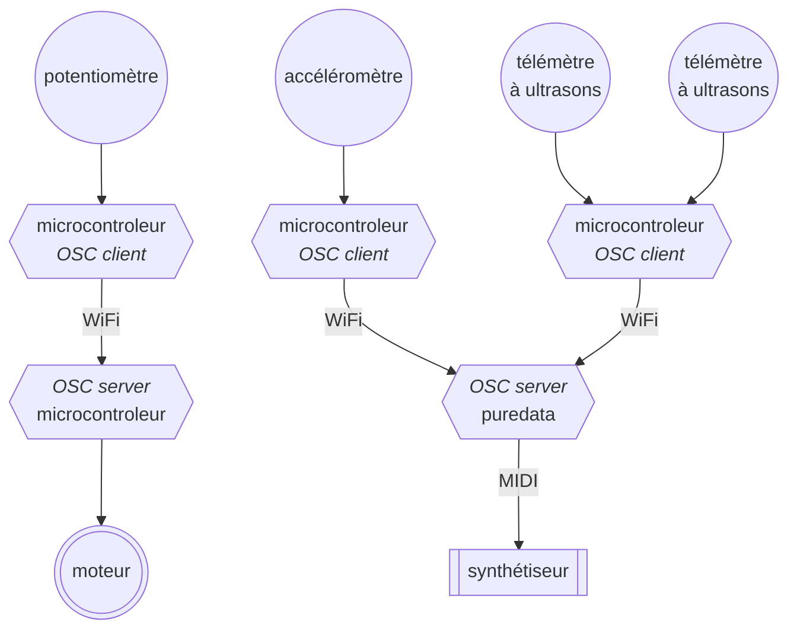

## Open Sound Control

_[Open Sound Control](https://fr.wikipedia.org/wiki/Open_Sound_Control)_ ou simplement OSC 
est un protocole de transfert de données entre toutes sortes d'équipements, ordinateurs,
synthétiseurs, robots, éclairages, ...
Le protocole définit sous quelle forme les données transitent d'un équipement à l'autre,
mais pas le moyen qu'elles empruntent ; un réseau sans fil ou filaire, par exemple.

Une présentation simple (en anglais) du protocole OSC est disponible sur
[OpenSoundControl.org](https://OpenSoundControl.org/).

OSC repose sur une architecture client-serveur, cela signifie qu'un ou plusieurs équipements,
appelés clients, envoient des informations à un serveur.

Dans notre cas, les clients sont des microcontrôleurs auxquels sont rattachés des capteurs.
Ils envoient les données de ces capteurs vers un serveur, ici un autre microcontrôleur ou un
ordinateur faisant fonctionner le logiciel Puredata (par exemple).

Dans le schéma ci-dessus, le synthétiseur est connecté à l'ordinateur avec une connexion
[MIDI](https://fr.wikipedia.org/wiki/Musical_Instrument_Digital_Interface), tandis que le
moteur est directement raccordé au microcontrôleur.

L'intérêt du protocole OSC est ici notamment lié à l'absence de fil entre le potentiomètre et
le moteur ou entre les autres capteurs et le synthétiseur. On peut donc imaginer des dispositifs
portatifs adaptés à une situation performative.

### Mise en œuvre

