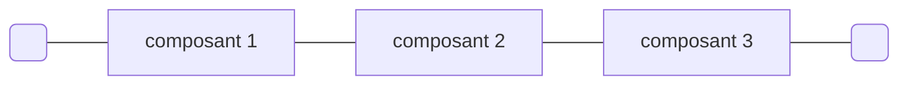
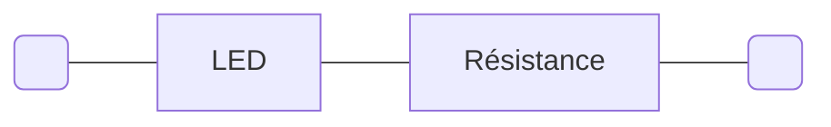
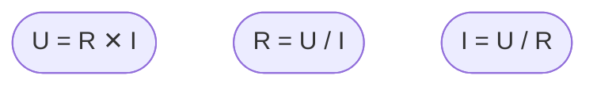

Une [LED](https://fr.wikipedia.org/wiki/Diode_%C3%A9lectroluminescente)
(_Light-Emitting Diode_), diode électroluminescente en français, est un composant
électronique semiconducteur qui produit de la lumière lorsqu'il est correctement alimenté.

À ce jour (2024/08/15), toutes les versions des cartes Raspberry Pi Pico sont équipées
d'une LED verte.


### Allumer la LED du Pico

Le programme suivant allume la LED de la carte Raspberry Pi Pico pendant 5 secondes,
puis l'éteint.

```python
import machine
import time

# On affecte à la variable led_pin un objet décrivant la broche à laquelle
# est connectée la LED du Pico et la configuration de cette broche (ici en sortie).
led_pin = machine.Pin("LED", machine.Pin.OUT)

# On appelle la méthode on() de l'objet led_pin afin de passer la broche correspondante
# à 1. Cela a pour effet d'alimenter la LED qui s'allume.
led_pin.on()

# On utilise la fonction sleep() du module time pour mettre le programme en pause
# pendant 5 secondes.
time.sleep(5)

# On appelle la méthode off() de l'objet led_pin afin de passer la broche correspondante
# à 0. Cela a pour effet d'éteindre la LED.
led_pin.off()
```

Le programme suivant fait clignoter la LED du Pico à une fréquence de 1 Hz, c'est-à-dire
que le cycle d'allumage et d'extinction de la LED se répète 1 fois par seconde.

```python
import machine
import time

# On configure la broche qui contrôle la LED du Pico.
led_pin = machine.Pin("LED", machine.Pin.OUT)

# On démarre une boucle infinie.
while True:
    # On appelle la méthode toggle() de l'objet led_pin afin de changer son état :
    # si la broche est à 1, elle bascule à 0,
    # si elle est à 0, elle bascule à 1.
    led_pin.toggle()
    
    # L'exécution du programme est suspendue pendant 0,5 seconde.
    time.sleep(0.5)
    
    # L'état de la LED reste inchangé (pendant le temps de la pause) jusqu'au
    # tour de boucle suivant.
```

Pouvoir contrôler la LED du Pico est d'une utilité limitée.
Nous allons voir comment connecter d'autres LED au Pico.

### Belle LED

Les LEDs ont des caractéristiques physiques variables. Les plus importantes sont leur
couleur, leur dimension et forme, leur tension d'alimentation et le courant maximum
qui peut les traverser sans les endommager.

La couleur d'une LED est déterminée par le matériau semiconducteur employé pour sa
fabrication (et rarement par la couleur du plastique qui l'encapsule).

Une LED est un composant électronique qui comporte deux pattes (deux pôles).
On dit que c'est un composant bipolaire.

Une diode (LED ou autre) laisse passer le courant si la tension appliquée à l'anode,
le pôle positif, est plus importante qu'à la cathode, le pôle négatif.
Si l'inverse se produit (c'est-à-dire que la tension est plus importante à la cathode
qu'à l'anode, la diode bloque le courant ou brule si la différence de potentiel, la différence
entre les deux tensions, dépasse une valeur maximale.


Les LEDs que l'on peut utiliser sur une plaque de prototypage sont disponibles
dans de nombreuses couleurs et généralement en 3 ou 5 mm de diamètre.


Pour connaître la tension d'alimentation exacte d'une LED et le courant qui peut la
traverser, il faut se référer à sa fiche technique.
La tension de fonctionnement d'une LED se situe généralement entre 1 et 3 volts.
Le courant peut aller de quelques milliampères pour les LEDs les plus courantes qui servent
à la signalisation visuelle, à quelques ampères pour les LEDs servant à l'éclairage.

Les tensions dont nous disposons sur notre platine d'essai sont :

- 5 volts fournis par la connexion USB de la carte Raspberry Pi Pico.
- 3,3 volts fournis par le convertisseur de tension qui équipe la carte Raspberry Pi Pico.

Les tensions fournies par notre carte sont donc trop élevées pour alimenter une LED,
il faut réduire la tension.

#### Circuit en série

Un circuit électrique en série est un circuit dans lequel des composants (bipôlaires / 
à deux pôles) sont connectés les uns après les autres.
La tension aux bornes d'un tel circuit est égale à la somme des tensions aux bornes
de chaque composant. 




La tension entre les extrémités du circuit est égale à la tension aux bornes de
`composant 1` + la tension aux bornes de `composant 2` + la tension aux bornes de
`composant 3`.

En vertu de la [loi d'Ohm](https://fr.wikipedia.org/wiki/Loi_d%27Ohm), 
une résistance connectée en série avec la LED va permettre de réduire la tension 
aux bornes de la LED. 



La loi d'Ohm est très simple : la tension `U` (en volts) aux bornes
d'une résistance est égale au produit du courant `I` (en ampères) qui la traverse par
sa valeur `R` (en ohms).



Prenons par exemple une LED dont la tension de fonctionnement est 2 volts et
le courant de fonctionnement 10 milliampères que nous alimentons à partir du rail
à 3,3 volts de notre plaque de prototypage.

La tension aux bornes de la résistance doit être 3,3 - 2 = 1,3 volts.
Connaissant la tension (1,3 V) et le courant (10 mA ou 0,01 A), la valeur de la résistance
peut-être calculée par la formule `R = U / I = 1,3 / 0,01 = 130 Ω (Ohm)`.

Ainsi pour alimenter une LED dont la tension de fonctionnement est 2 V et
le courant 10 mA à partir d'une source de 3,3 V. Il faudra connecter la LED en série
avec une résistance _d'au moins_ 130 Ω. Une valeur de résistance supérieure diminuera 
la luminosité de la LED.

À noter que l'énergie consommée par la résistance pour protéger la LED sera dissipée
sous forme de chaleur. Cela implique que la puissance de la
résistance doit être appropriée à son usage. Les résistances de 1/8, 1/4 ou 1/2 watt
sont communes. La puissance effectivement dissipée par la résistance se calcule à
l'aide de la formule suivante `P = U ✕ I` avec `P`, la puissance exprimée en watts,
`U` en volts et `I` en ampères.

Dans le cas qui nous occupe, la résistance devra dissiper `P = U ✕ I = 1,3 ✕ 0,01 = 0,013 W`,
une résistance de 1/8 W suffira amplement.

Si vous voulez vous épargner l'effort de ce calcul, nombre de pages web le feront
pour vous. Par exemple : 
[calculateur de résistance pour LED chez DigiKey](https://www.digikey.fr/fr/resources/conversion-calculators/conversion-calculator-led-series-resistor)

#### Représentation schématique

Avant de câbler le circuit sur la plaque de prototypage, il peut être utile de tracer
un schéma du circuit.


Les circuits intégrés tels que celui utilisé sont généralement représentés
de façon générique par un carré ou un rectangle d'où partent les différentes connexions.

En revanche, pour de nombreux composants, il existe une (ou plusieurs) représentations
normalisées.

Dans le schéma, on peut voir que la résistance et la LED sont câblées en série,
que la cathode (le pôle négatif) de la LED est connectée à la masse 
du Raspberry Pi Pico qui ne sert qu'à produire la tension de 3,3 V.

#### Résistance


Comme montré dans le dessin ci-dessus, les 
[résistances](https://fr.wikipedia.org/wiki/R%C3%A9sistance_(composant))
peuvent être schématiquement représentées de deux façons.

Ce sont des composants bipôlaires
mais ils fonctionnent de manière identique dans les deux sens.

Les résistances les plus courantes dans les usages de hobby se présentent sous
la forme d'un petit cylindre d'environ 10 mm de long et de 2 ou 3 mm de diamètre
à chaque extrémité duquel sort une patte métallique (que l'on enfichera dans la plaque
de prototypage).
Le corps cylindrique porte plusieurs bandes de couleur qui permettent de noter
certaines caractéristiques techniques du composant notamment sa valeur en ohms et 
sa tolérance (la précision de sa valeur).
Le tableau ci-dessous permet de déterminer la valeur d'une résistance d'après la couleur
des bandes qu'elle porte.


Sauriez-vous déterminer les valeurs des résistances ci-dessous (réponse au bas de cette page) ?


Des aides en ligne sont disponibles pour déterminer ces valeurs, par exemple :
[calculateur de code couleur des résistances chez DigiKey](https://www.digikey.fr/fr/resources/conversion-calculators/conversion-calculator-resistor-color-code).

#### LED


Le dessin ci-dessus est la représentation symbolique d'une LED.
Il s'agit de la représentation d'une diode à laquelle sont ajoutées des flêches
figurant la lumière émise.

Le côté positif d'une diode (l'anode) est matérialisé par un triangle,
le côte négatif (la cathode) est matérialisé par une barre.


### Câblage du circuit


### Solution de la question sur les valeurs de résistances

De haut en bas :

- 4.7kΩ ±5%
- 2.2kΩ ±5%
- 100Ω ±5%
- 1.5kΩ ±5%
- 47Ω ±5%
- 39kΩ ±5%


Source de l'image : https://en.wikipedia.org/wiki/Resistor#/media/File:Electronic-Axial-Lead-Resistors-Array.png

