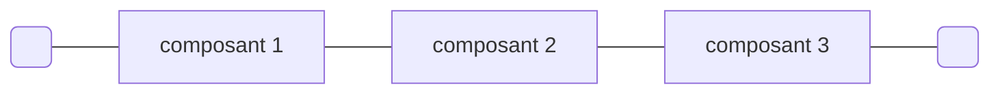
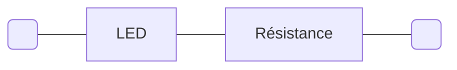
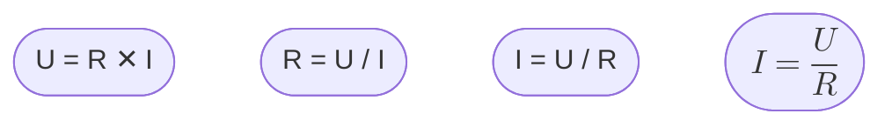
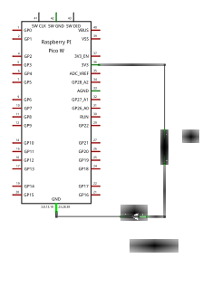

Une [LED](https://fr.wikipedia.org/wiki/Diode_%C3%A9lectroluminescente)
(_Light-Emitting Diode_), diode électroluminescente en français, est un composant
électronique qui produit de la lumière lorsqu'il est correctement alimenté.


À ce jour (2024/08/15), toutes les versions des cartes Raspberry Pi Pico sont équipées
d'une LED.


### Allumer une LED

Les LEDs ont des caractéristiques physiques variables. Les plus importantes sont leur
couleur, leur dimension et forme, leur tension d'alimentation et le courant maximum
qui peut les traverser sans les endommager.

La couleur d'une LED est déterminée par le matériau semiconducteur employé pour sa
fabrication (et rarement par la couleur du plastique qui l'encapsule).

Une LED est un composant électronique qui comporte deux pattes (deux pôles).
Pour que la LED s'allume, la patte la plus longue (le pôle positif),
doit être raccordée à la borne positive du circuit,
la patte la plus courte (le pôle négatif), doit être raccordée à la masse.

Pour connaître la tension d'alimentation exacte d'une LED et le courant qui peut la
traverser, il faut se référer à sa fiche technique.
La tension de fonctionnement d'une LED se situe généralement entre 1 et 3 volts.
Le courant peut aller de quelques milliampères pour les LEDs les plus courantes qui servent
à la signalisation visuelle, à quelques ampères pour les LEDs servant à l'éclairage.

Les tensions dont nous disposons sur notre platine d'essai sont :

- 5 volts fournis par la connexion USB de la carte Raspberry Pi Pico.
- 3,3 volts fournis par le convertisseur de tension qui équipe la carte Raspberry Pi Pico.

#### Circuit en série

Un circuit électrique en série est un circuit dans lequel des composants (bipôlaires / 
à deux pôles) sont connectés les uns après les autres.
La tension aux bornes d'un tel circuit est égale à la somme des tensions aux bornes
de chaque composant. 




La tension entre les extrémités du circuit est égale à la tension aux bornes de
`composant 1` + la tension aux bornes de `composant 2` + la tension aux bornes de
`composant 3`.

En vertu de la [loi d'Ohm](https://fr.wikipedia.org/wiki/Loi_d%27Ohm), 
une résistance connectée en série avec la LED va permettre de réduire la tension 
aux bornes de la LED. 



La loi d'Ohm est très simple : la tension `U` (en volts) aux bornes
d'une résistance est égale au produit du courant `I` (en ampères) qui la traverse par
sa valeur `R` (en ohms).




La valeur de la résistance peut être calculée en appliquant la loi d'Ohm.

[Calculateur de résistance pour LED](https://www.digikey.fr/fr/resources/conversion-calculators/conversion-calculator-led-series-resistor)




### LED clignotante

Le programme suivant fait clignoter la LED du Pico à une fréquence de 1 Hz, c'est-à-dire
que le cycle d'allumage et d'extinction de la LED se répète 1 fois par seconde.

```python
import machine
import time

# On affecte à la variable led_pin un objet décrivant la broche à laquelle
# est connectée la LED du Pico et la configuration de cette broche (ici en sortie).
led_pin = machine.Pin("LED", machine.Pin.OUT)

# On démarre une boucle infinie.
while True:
    # On change l'état de la broche
    # (si elle est à 1, elle bascule à 0, si elle est à 0, elle bascule à 1).
    led_pin.toggle()
    # L'exécution du programme est suspendue pendant 0,5 seconde.
    time.sleep(0.5)
    # L'état de la LED reste inchangé (pendant le temps de la pause) jusqu'au
    # tour de boucle suivant.
```


